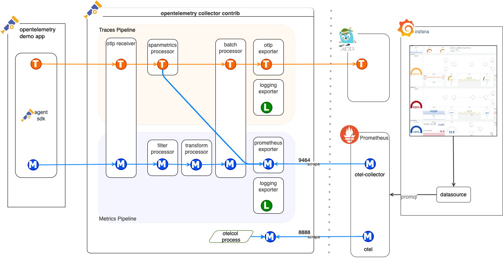
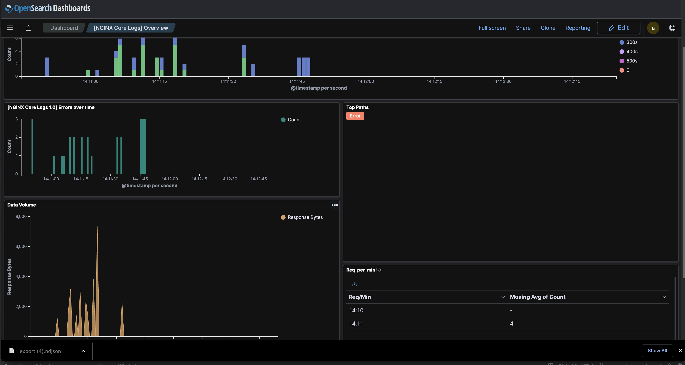
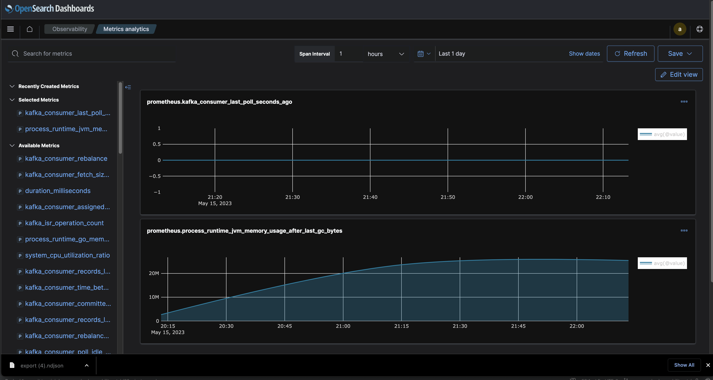
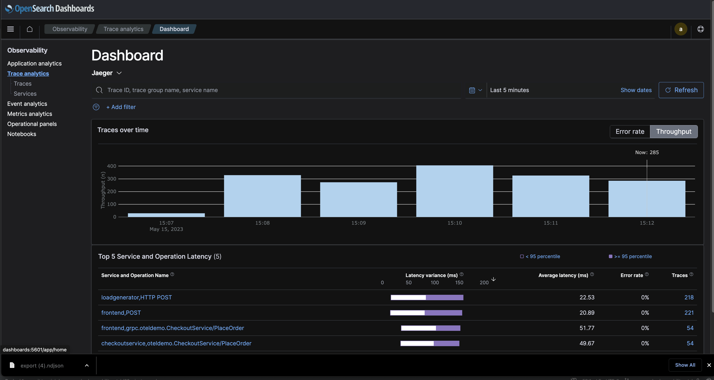
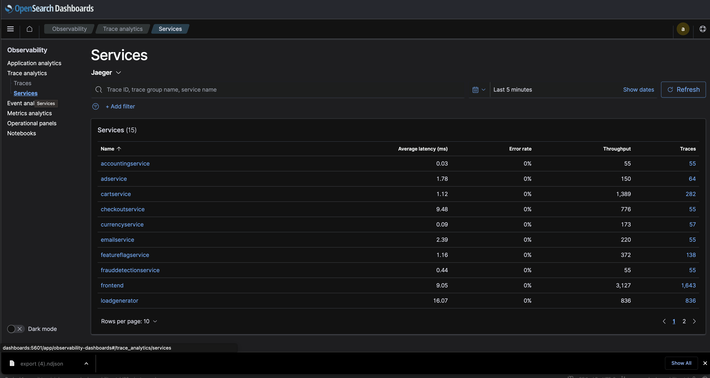
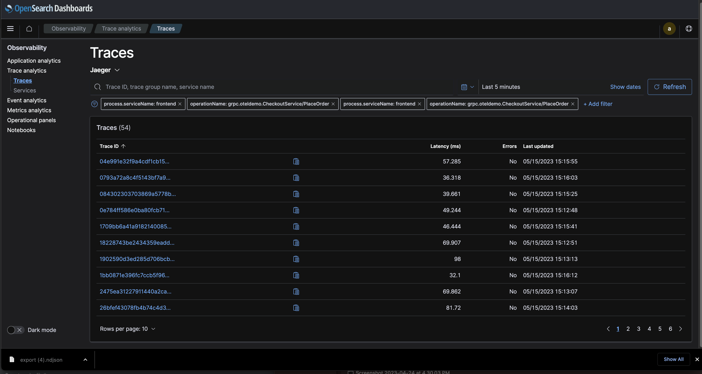
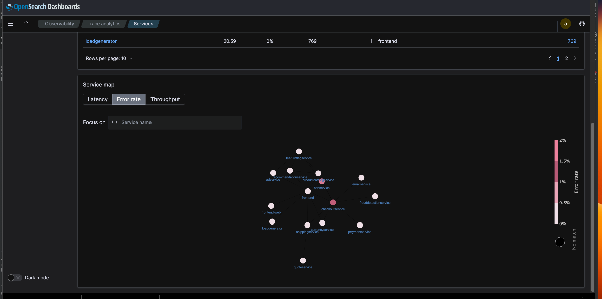

# Opensearch OTEL Demo Architecture
This document will review the OpenSearch architecture for the [OTEL demo](https://opentelemetry.io/docs/demo/) and will review how to use the new Observability capabilities
implemented into OpenSearch.
---
This diagram provides an overview of the system components, showcasing the configuration derived from the OpenTelemetry Collector (otelcol) configuration file utilized by the OpenTelemetry demo application.

Additionally, it highlights the observability data (traces and metrics) flow within the system.

---
[OTEL DEMO](https://opentelemetry.io/docs/demo/architecture/) Describes the list of services that are composing the Astronomy Shop.

They are combined of:
 - [Accounting](https://opentelemetry.io/docs/demo/services/accounting/)
 - [Ad](https://opentelemetry.io/docs/demo/services/ad/)
 - [Cart](https://opentelemetry.io/docs/demo/services/cart/)
 - [Checkout](https://opentelemetry.io/docs/demo/services/checkout/)
 - [Currency](https://opentelemetry.io/docs/demo/services/currency/)
 - [Email](https://opentelemetry.io/docs/demo/services/email/)
 - [Feature Flag](https://opentelemetry.io/docs/demo/services/feature-flag/)
 - [Fraud Detection](https://opentelemetry.io/docs/demo/services/fraud-detection/)
 - [Frontend](https://opentelemetry.io/docs/demo/services/frontend/)
 - [Kafka](https://opentelemetry.io/docs/demo/services/kafka/)
 - [Payment](https://opentelemetry.io/docs/demo/services/payment/)
 - [Product Catalog](https://opentelemetry.io/docs/demo/services/product-catalog/)
 - [Quote](https://opentelemetry.io/docs/demo/services/quote/)
 - [Recommendation](https://opentelemetry.io/docs/demo/services/recommendation/)
 - [Shipping](https://opentelemetry.io/docs/demo/services/shipping/)
 - [Fluent-Bit](../src/fluent-bit/README.md) *(nginx's otel log exported)* 
 - [Integrations](../src/integrations/README.md) *(pre-canned OpenSearch assets)* 
 - [DataPrepper](../src/dataprepper/README.md) *(OpenSearch's ingestion pipeline)

Backend supportive services
 - [Load Generator](http://load-generator:8089)
   - See [description](https://opentelemetry.io/docs/demo/services/load-generator/)
 - [Frontend Nginx Proxy](http://nginx:90) *(replacement for _Frontend-Proxy_)*
   - See [description](../src/nginx-otel/README.md)
 - [OpenSearch](https://opensearch-node1:9200)
    - See [description](https://github.com/YANG-DB/opentelemetry-demo/blob/12d52cbb23bbf4226f6de2dfec840482a0a7d054/docker-compose.yml#L697)
 - [Dashboards](http://opensearch-dashboards:5601)
   - See [description](https://github.com/YANG-DB/opentelemetry-demo/blob/12d52cbb23bbf4226f6de2dfec840482a0a7d054/docker-compose.yml#L747) 
 - [Prometheus](http://prometheus:9090)
   - See [description](https://github.com/YANG-DB/opentelemetry-demo/blob/12d52cbb23bbf4226f6de2dfec840482a0a7d054/docker-compose.yml#L674)
 - [Feature-Flag](http://feature-flag-service:8881)
   - See [description](../src/featureflagservice/README.md)
 - [Grafana](http://grafana:3000)
   - See [description](https://github.com/YANG-DB/opentelemetry-demo/blob/12d52cbb23bbf4226f6de2dfec840482a0a7d054/docker-compose.yml#L637)
---

## Purpose
The purpose of this demo is to demonstrate the different capabilities of OpenSearch Observability to investigate and reflect your system.

### Ingestion 
The ingestion capabilities for OpenSearch is to be able to support multiple pipelines:
  - [Data-Prepper](https://github.com/opensearch-project/data-prepper/) is an OpenSearch ingestion project that allows ingestion of OTEL standard signals using Otel-Collector
  - [Jaeger](https://opensearch.org/docs/latest/observing-your-data/trace/trace-analytics-jaeger/) is an ingestion framework which has a build in capability for pushing OTEL signals into OpenSearch
  - [Fluent-Bit](https://docs.fluentbit.io/manual/pipeline/outputs/opensearch) is an ingestion framework which has a build in capability for pushing OTEL signals into OpenSearch

### Integrations -
The integration service is a list of pre-canned assets that are loaded in a combined manner to allow users the ability for simple and automatic way to discover and review their services topology.

These (demo-sample) integrations contain the following assets:
 - components & index template mapping
 - datasources 
 - data-stream & indices
 - queries
 - dashboards
   
Once they are loaded, the user can imminently review his OTEL demo services and dashboards that reflect the system state.
 - [Nginx Dashboard](../src/integrations/display/nginx-logs-dashboard-new.ndjson) - reflects the Nginx Proxy server that routes all the network communication to/from the frontend
 - [Prometheus datasource](../src/integrations/datasource/prometheus.json) - reflects the connectivity to the prometheus metric storage that allows us to federate metrics analytics queries
 - [Logs Datastream](../src/integrations/indices/data-stream.json) - reflects the data-stream used by nginx logs ingestion and dashboards representing a well-structured [log schema](../src/integrations/mapping-templates/logs.mapping)

Once these assets are loaded - the user can start reviewing its Observability dashboards and traces

---

### **Scenarios**

How can you solve problems with OpenTelemetry? These scenarios walk you through some pre-configured problems and show you how to interpret OpenTelemetry data to solve them.

- Generate a Product Catalog error for GetProduct requests with product id: OLJCESPC7Z using the Feature Flag service
- Discover a memory leak and diagnose it using metrics and traces. Read more

### **Reference**
Project reference documentation, like requirements and feature matrices [here](https://opentelemetry.io/docs/demo/#reference)

