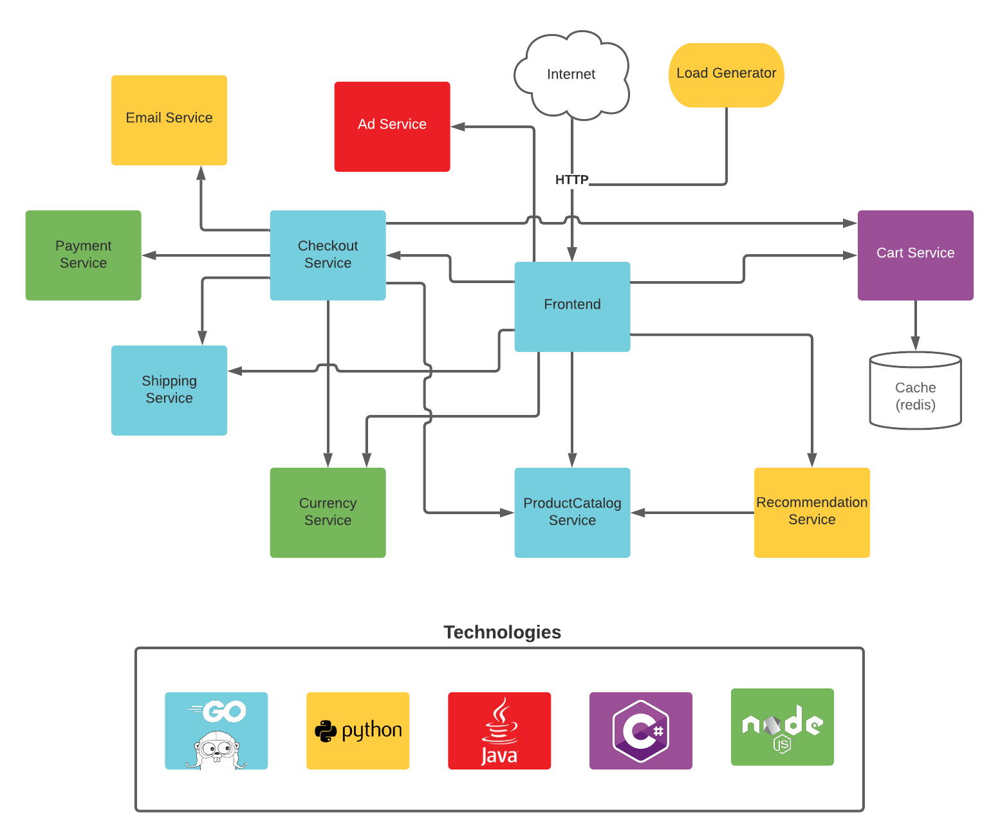

# Webstore Demo

<p align="center">

</p>

---

## This repo was modified and it is used to demonstrate OpenTelemetry capabilities
All the services had their OpenCensus, Cloud Operations (Stackdriver) removed. Only OpenTelemetry Traces were added.   

---

**Online Boutique** is a cloud-native microservices demo application.
Online Boutique consists of a 10-tier microservices application + 1 Load Generator. The application is a web-based e-commerce app where users can browse items, add them to the cart, and purchase them.

**Google uses the original application to demonstrate use of technologies like Kubernetes/GKE, Istio, Stackdriver, gRPC and OpenCensus**. This application works on any Kubernetes cluster, as well as Google Kubernetes Engine. It’s **easy to deploy with little to no configuration**.
You can find the one used by Google here: https://github.com/GoogleCloudPlatform/microservices-demo

If you’re using this demo, please **★Star** this repository to show your interest!

## Screenshots from the Online Boutique

| Home Page                                                                                                         | Checkout Screen                                                                                                    |
| ----------------------------------------------------------------------------------------------------------------- | ------------------------------------------------------------------------------------------------------------------ |
| [](./docs/img/online-boutique-frontend-1.png) | [](./docs/img/online-boutique-frontend-2.png) |

## Screenshots from Jaeger
| Jaeger UI                                                                                                         | Trace View                                                                                                    |
| ----------------------------------------------------------------------------------------------------------------- | ------------------------------------------------------------------------------------------------------------------ |
| [](./docs/img/jaeger-ui.png) | [](./docs/img/jaeger-trace-view.png) |

## Quickstart (GKE)

If you'd like to follow Google's quickstart to deploy the sample in GKE,  please refer to [the original repository](https://github.com/GoogleCloudPlatform/microservices-demo#quickstart-gke).    
This repository will work with skaffold in the same way.  

## Quickstart (Local with Docker)
**Docker is required.**  
If you want to test it locally without a kubernetes cluster, you can follow the steps below.

1. **Clone this repository.**

```
git clone https://github.com/julianocosta89/opentelemetry-microservices-demo.git
cd opentelemetry-microservices-demo
```

2. **Build and run the containers.**  
We can simply use the script [hack/build-and-run.sh.](hack/build-and-run.sh) for this.  
The script requires a TAG as parameter to build all container images and run them in a docker network called `online-boutique`.  

```
TAG=1.0.0 ./hack/build-and-run.sh
```

3. **Wait for the containers to be ready.**  
The first time you run the previous command it takes some minutes to build everything.  
Once it finishes, you can check the running containers:
```
docker ps
```

You should see:
```
CONTAINER ID   IMAGE                           COMMAND                  CREATED          STATUS          PORTS                                                                                                                                                                                                                                                                                                                                                                 NAMES
610e1ffb8f3e   loadgenerator:1.0.0             "/bin/sh -c 'locust …"   35 seconds ago   Up 33 seconds                                                                                                                                                                                                                                                                                                                                                                         loadgenerator
430b8b64f1f4   shippingservice:1.0.0           "/src/shippingservice"   35 seconds ago   Up 34 seconds   0.0.0.0:49162->50051/tcp, :::49162->50051/tcp                                                                                                                                                                                                                                                                                                                         shippingservice
76d72b930915   recommendationservice:1.0.0     "opentelemetry-instr…"   36 seconds ago   Up 35 seconds   0.0.0.0:49161->8080/tcp, :::49161->8080/tcp                                                                                                                                                                                                                                                                                                                           recommendationservice
70f5946dddff   productcatalogservice:1.0.0     "/src/server"            37 seconds ago   Up 35 seconds   0.0.0.0:49160->3550/tcp, :::49160->3550/tcp                                                                                                                                                                                                                                                                                                                           productcatalogservice
261d476b1e11   paymentservice:1.0.0            "node --require ./tr…"   37 seconds ago   Up 36 seconds   0.0.0.0:49159->50051/tcp, :::49159->50051/tcp                                                                                                                                                                                                                                                                                                                         paymentservice
a74930edbb96   frontend:1.0.0                  "/src/server"            38 seconds ago   Up 37 seconds   0.0.0.0:8080->8080/tcp, :::8080->8080/tcp                                                                                                                                                                                                                                                                                                                             frontend
b223ca330de7   emailservice:1.0.0              "opentelemetry-instr…"   39 seconds ago   Up 38 seconds   0.0.0.0:49158->8080/tcp, :::49158->8080/tcp                                                                                                                                                                                                                                                                                                                           emailservice
eb3729c0f2d3   currencyservice:1.0.0           "node --require ./tr…"   40 seconds ago   Up 38 seconds   0.0.0.0:49157->7000/tcp, :::49157->7000/tcp                                                                                                                                                                                                                                                                                                                           currencyservice
6178957b18df   checkoutservice:1.0.0           "/src/checkoutservice"   40 seconds ago   Up 39 seconds   0.0.0.0:49156->5050/tcp, :::49156->5050/tcp                                                                                                                                                                                                                                                                                                                           checkoutservice
4fb5500e3f01   cartservice:1.0.0               "/app/cartservice"       41 seconds ago   Up 40 seconds   0.0.0.0:49155->7070/tcp, :::49155->7070/tcp                                                                                                                                                                                                                                                                                                                           cartservice
a0f1de606609   adservice:1.0.0                 "/app/build/install/…"   41 seconds ago   Up 40 seconds   0.0.0.0:49154->9555/tcp, :::49154->9555/tcp                                                                                                                                                                                                                                                                                                                           adservice
ad06d33dea6d   redis:alpine                    "docker-entrypoint.s…"   42 seconds ago   Up 40 seconds   0.0.0.0:49153->6379/tcp, :::49153->6379/tcp                                                                                                                                                                                                                                                                                                                           redis-cart
0baec02fc020   otelcollector:1.0.0             "/otelcol --config=c…"   42 seconds ago   Up 41 seconds   1888/tcp, 4317/tcp, 8888-8889/tcp, 13133/tcp, 55670/tcp, 55678-55679/tcp                                                                                                                                                                                                                                                                                              otelcollector
eb39e7c3ff04   jaegertracing/all-in-one:1.30   "/go/bin/all-in-one-…"   43 seconds ago   Up 41 seconds   0.0.0.0:5775->5775/udp, :::5775->5775/udp, 0.0.0.0:5778->5778/tcp, :::5778->5778/tcp, 0.0.0.0:9411->9411/tcp, :::9411->9411/tcp, 0.0.0.0:14250->14250/tcp, :::14250->14250/tcp, 0.0.0.0:14268-14269->14268-14269/tcp, :::14268-14269->14268-14269/tcp, 0.0.0.0:6831-6832->6831-6832/udp, :::6831-6832->6831-6832/udp, 0.0.0.0:16686->16686/tcp, :::16686->16686/tcp   jaeger
```

4. **Access the web frontend in a browser**:  
 The frontend will be available at: `http://localhost:8080/`.

5. **Access Jaeger in a browser to view your traces**:  
 The Jaeger UI will be available at: `http://localhost:16686/`.

6. [Optional] **Clean up**:  
To kill all containers, simply run [hack/kill-containers.sh.](hack/kill-containers.sh)

```
./kill-containers.sh
```

## Other Deployment Options

If you'd like to check other deployment options,  please refer to [the original repository](https://github.com/GoogleCloudPlatform/microservices-demo#other-deployment-options).  

## Architecture

**Online Boutique** is composed of 10 microservices written in different languages that talk to each other over gRPC. Plus one Load Generator which uses Locust to fake user traffic.  
See the [Development Principles](/docs/development-principles.md) doc for more information.

[](./docs/img/architecture-diagram.png)

Find **Protocol Buffers Descriptions** at the [`./pb` directory](./pb).

| Service                                              | Language      | Description                                                                                                                       |
| ---------------------------------------------------- | ------------- | --------------------------------------------------------------------------------------------------------------------------------- |
| [frontend](./src/frontend)                           | Go            | Exposes an HTTP server to serve the website. Does not require signup/login and generates session IDs for all users automatically. |
| [cartservice](./src/cartservice)                     | C#            | Stores the items in the user's shopping cart in Redis and retrieves it.                                                           |
| [productcatalogservice](./src/productcatalogservice) | Go            | Provides the list of products from a JSON file and ability to search products and get individual products.                        |
| [currencyservice](./src/currencyservice)             | Node.js       | Converts one money amount to another currency. Uses real values fetched from European Central Bank. It's the highest QPS service. |
| [paymentservice](./src/paymentservice)               | Node.js       | Charges the given credit card info (mock) with the given amount and returns a transaction ID.                                     |
| [shippingservice](./src/shippingservice)             | Go            | Gives shipping cost estimates based on the shopping cart. Ships items to the given address (mock)                                 |
| [emailservice](./src/emailservice)                   | Python        | Sends users an order confirmation email (mock).                                                                                   |
| [checkoutservice](./src/checkoutservice)             | Go            | Retrieves user cart, prepares order and orchestrates the payment, shipping and the email notification.                            |
| [recommendationservice](./src/recommendationservice) | Python        | Recommends other products based on what's given in the cart.                                                                      |
| [adservice](./src/adservice)                         | Java          | Provides text ads based on given context words.                                                                                   |
| [loadgenerator](./src/loadgenerator)                 | Python/Locust | Continuously sends requests imitating realistic user shopping flows to the frontend.                                              |

## Features

- **[Kubernetes](https://kubernetes.io):**  
  The app is designed to run on Kubernetes (both locally , as well as on the cloud).
- **[Docker](https://docs.docker.com):**  
  This forked sample can also be executed only with Docker.
- **[gRPC](https://grpc.io):**  
  Microservices use a high volume of gRPC calls to communicate to each other.
- **[Istio](https://istio.io):**  
  Application works on Istio service mesh.
- **[OpenTelemetry Traces](https://opentelemetry.io):**  
  All services are instrumented using OpenTelemetry available instrumentation libraries.
- **[OpenTelemetry Collector](https://opentelemetry.io/docs/collector/getting-started):**  
  All services are instrumented and sending the generated traces to the OpenTelemetry Collector via gRPC. The received traces are then exported to the logs and to Jaeger.
- **[Jager](https://www.jaegertracing.io):**  
  All generated traces are being sent to Jaeger.
- **[Skaffold](https://skaffold.dev):**  
  Application is deployed to Kubernetes with a single command using Skaffold.
- **Synthetic Load Generation:**  
  The application demo comes with a background job that creates realistic usage patterns on the website using [Locust](https://locust.io/) load generator.

## Local Development

If you would like to contribute features or fixes to this app, see the [Development Guide](/docs/development-guide.md) on how to build this demo locally.

## Demos featuring Online Boutique

Check out Google's [Demos featuring Online Boutique](https://github.com/GoogleCloudPlatform/microservices-demo#demos-featuring-online-boutique)

---

This is not an official Google project.

## Contributing

See [CONTRIBUTING.md](CONTRIBUTING.md)

We meet weekly Monday's at 8:15 PT. The meeting is subject to change depending on
contributors' availability. Check the [OpenTelemetry community
calendar](https://calendar.google.com/calendar/embed?src=google.com_b79e3e90j7bbsa2n2p5an5lf60%40group.calendar.google.com)
for specific dates and Zoom meeting links.

Meeting notes are available as a public [Google
doc](https://docs.google.com/document/d/16f-JOjKzLgWxULRxY8TmpM_FjlI1sthvKurnqFz9x98/edit).
For edit access, get in touch on
[Slack](https://cloud-native.slack.com/archives/C03B4CWV4DA).

[Maintainers](https://github.com/open-telemetry/community/blob/main/community-membership.md#maintainer)
([@open-telemetry/demo-webstore-maintainers](https://github.com/orgs/open-telemetry/teams/demo-webstore-maintainers)):

* [Austin Parker](https://github.com/austinlparker), Lightstep
* [Carter Socha](https://github.com/cartersocha), Microsoft
* [Morgan McLean](https://github.com/mtwo), Splunk

[Approvers](https://github.com/open-telemetry/community/blob/main/community-membership.md#approver)
([@open-telemetry/demo-webstore-approvers](https://github.com/orgs/open-telemetry/teams/demo-webstore-approvers)):

* [Joe Sirianni](https://github.com/jsirianni), ObservIQ
* [Juliano Costa](https://github.com/julianocosta89), Dynatrace
* [Michael Maxwell](https://github.com/mic-max), Microsoft
* [Reiley Yang](https://github.com/reyang), Microsoft

### Thanks to all the people who have contributed

[](https://github.com/open-telemetry/opentelemetry-demo-webstore/graphs/contributors)
