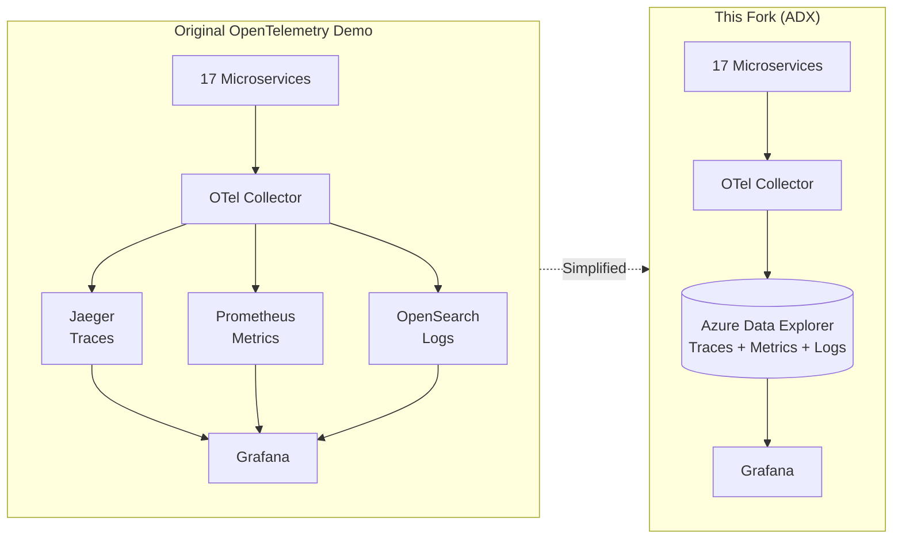
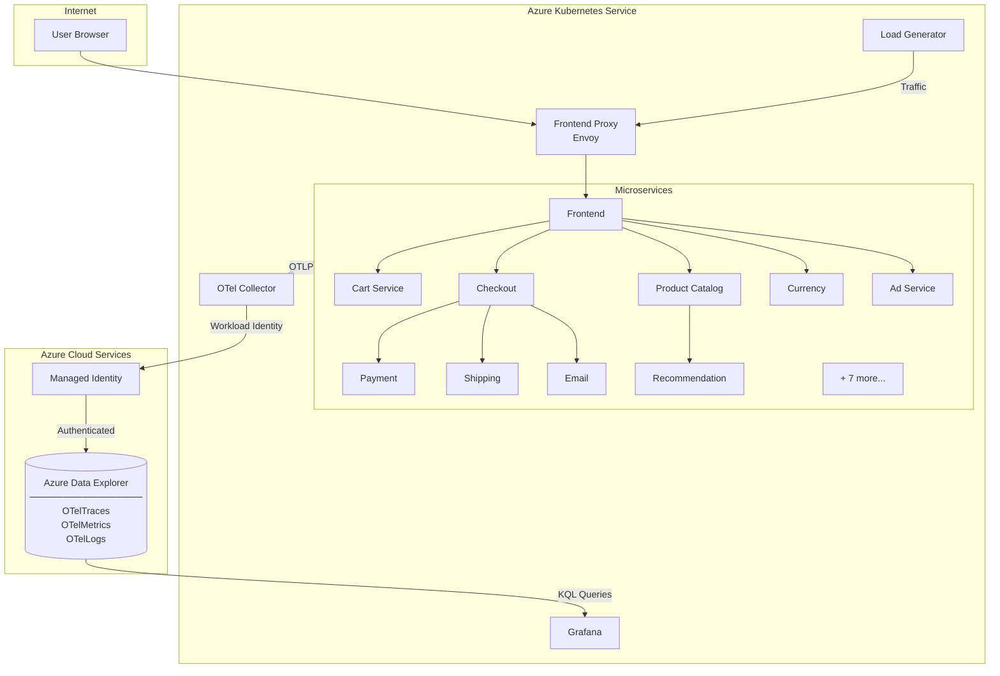
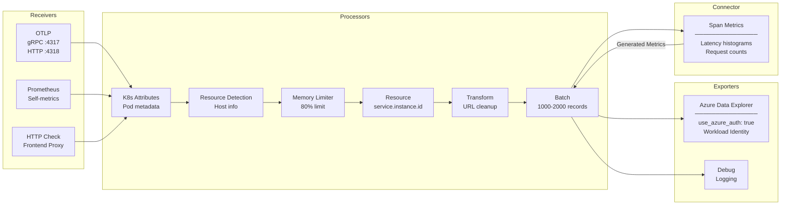
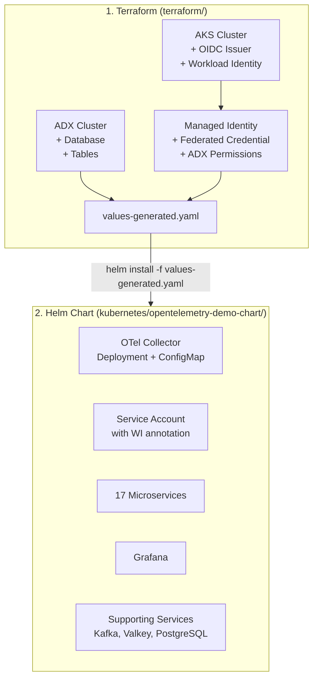
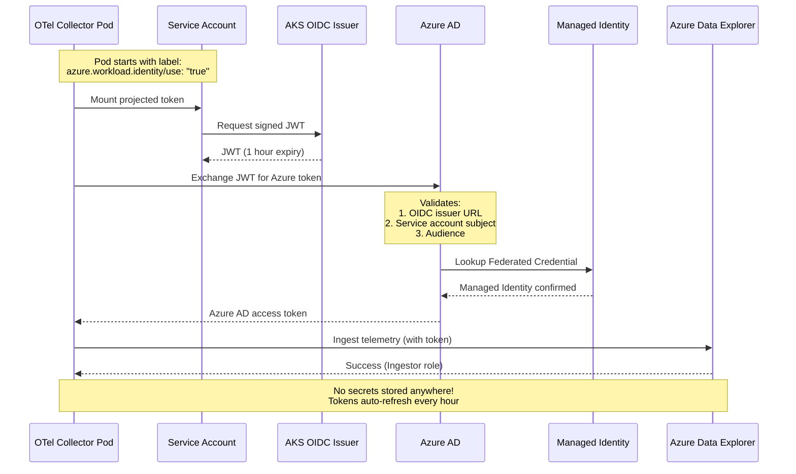

# OpenTelemetry Demo with Azure Data Explorer

<p align="center">
  
  &nbsp;&nbsp;&nbsp;&nbsp;
  
</p>

<p align="center">
  <strong>A simplified, production-ready OpenTelemetry demo with Azure Data Explorer as the sole telemetry backend</strong>
</p>

<p align="center">
  <a href="#-quick-start">Quick Start</a> &bull;
  <a href="#-architecture">Architecture</a> &bull;
  <a href="#-how-it-differs-from-the-original">How It Differs</a> &bull;
  <a href="#-workload-identity">Workload Identity</a> &bull;
  <a href="#-deployment-guide">Deployment</a>
</p>

<p align="center">
  <a href="https://github.com/roy2392/adx-opentelemetry-demo/blob/main/LICENSE">
    
  </a>
</p>

---

## What Is This?

This is a **fork of the [OpenTelemetry Demo](https://github.com/open-telemetry/opentelemetry-demo)** that replaces multiple observability backends (Jaeger, Prometheus, OpenSearch) with a single, unified backend: **Azure Data Explorer (ADX)**.

### Why Azure Data Explorer?

| Challenge with Original Demo | Solution with ADX |
|------------------------------|-------------------|
| 3 separate backends (Jaeger, Prometheus, OpenSearch) | 1 unified backend for traces, metrics, and logs |
| Complex deployment with many components | Simplified architecture with fewer moving parts |
| No native Azure integration | Native Azure services with Workload Identity |
| Data scattered across systems | All telemetry in one place with powerful KQL queries |
| SaaS observability costs ($$$) | Pay only for Azure resources (~$150/month for dev) |

---

## How It Differs from the Original



### Key Differences

| Aspect | Original Demo | This Fork |
|--------|--------------|-----------|
| **Backends** | Jaeger + Prometheus + OpenSearch | Azure Data Explorer only |
| **Infrastructure** | Docker Compose / Generic K8s | Terraform + AKS + Helm |
| **Authentication** | N/A | Azure Workload Identity (no secrets!) |
| **Query Language** | PromQL + Jaeger UI + OpenSearch | KQL (Kusto Query Language) |
| **Deployment** | `docker compose up` | `terraform apply` + `helm install` |
| **Data Retention** | Limited by local storage | 1 year (configurable) |
| **Cost** | Free (local) / Variable (cloud) | ~$150-500/month on Azure |

---

## Architecture

### High-Level Overview



### OTel Collector Pipeline



### Deployment Flow



---

## Quick Start

### Prerequisites

| Tool | Version | Installation |
|------|---------|--------------|
| Azure CLI | Latest | `brew install azure-cli` or [Install Guide](https://docs.microsoft.com/en-us/cli/azure/install-azure-cli) |
| Terraform | >= 1.5.0 | `brew install terraform` or [Install Guide](https://learn.hashicorp.com/tutorials/terraform/install-cli) |
| kubectl | Latest | `brew install kubectl` or [Install Guide](https://kubernetes.io/docs/tasks/tools/) |
| Helm | >= 3.0 | `brew install helm` or [Install Guide](https://helm.sh/docs/intro/install/) |

You also need an **Azure Subscription** with Owner or Contributor access.

### Step 1: Clone the Repository

```bash
git clone https://github.com/roy2392/adx-opentelemetry-demo.git
cd adx-opentelemetry-demo
```

### Step 2: Login to Azure

```bash
az login
az account set --subscription "<your-subscription-id>"
```

### Step 3: Deploy Infrastructure with Terraform

```bash
cd terraform

# Copy example variables file
cp terraform.tfvars.example terraform.tfvars

# Edit terraform.tfvars with your preferences:
# - project_name = "otel-demo"
# - environment  = "dev"
# - location     = "eastus"

# Initialize and deploy
terraform init
terraform apply
```

**Terraform creates:**
- Azure Data Explorer cluster with `otel_demo` database and tables
- AKS cluster with OIDC issuer and Workload Identity enabled
- User-Assigned Managed Identity with ADX Ingestor + Viewer permissions
- Federated Identity Credential linking K8s service account to the identity
- `values-generated.yaml` with all configuration (no secrets!)

### Step 4: Deploy to AKS with Helm

```bash
# Get AKS credentials (command shown in Terraform output)
az aks get-credentials --resource-group <rg-name> --name <aks-name>

# Return to project root
cd ..

# Deploy using Terraform-generated values
helm install otel-demo ./kubernetes/opentelemetry-demo-chart \
  -f ./kubernetes/opentelemetry-demo-chart/values-generated.yaml \
  -n otel-demo --create-namespace

# Watch pods come up (takes 2-3 minutes)
kubectl get pods -n otel-demo -w
```

### Step 5: Access the Demo

```bash
# Frontend (Web Store) - http://localhost:8080
kubectl port-forward -n otel-demo svc/frontend-proxy 8080:8080

# Grafana (Dashboards) - http://localhost:3000
# Login: admin / admin
kubectl port-forward -n otel-demo svc/grafana 3000:80
```

### Step 6: Verify Data in ADX

```bash
# Check OTel Collector is sending data
kubectl logs -n otel-demo deployment/otel-collector | grep azuredataexplorer

# You should see: "Flushing X metrics to sink"
```

---

## Workload Identity

This fork uses **Azure Workload Identity** for secure, secret-less authentication to ADX.

### Authentication Flow



### Why Workload Identity?

| Aspect | Service Principal (Secrets) | Workload Identity |
|--------|----------------------------|-------------------|
| **Secrets** | Client secret stored in K8s | No secrets anywhere |
| **Rotation** | Manual (every 6-12 months) | Automatic (~1 hour) |
| **Blast Radius** | Full access if secret leaked | Pod-scoped tokens only |
| **Audit** | Limited visibility | Full Azure AD logs |
| **Setup** | Create SP, manage secret | Terraform handles everything |

### Verify Workload Identity is Active

```bash
# Check pod has Workload Identity environment variables
kubectl get pod -n otel-demo -l app.kubernetes.io/name=opentelemetry-collector \
  -o jsonpath='{.items[0].spec.containers[0].env[*].name}' | tr ' ' '\n' | grep AZURE

# Expected output:
# AZURE_TENANT_ID
# AZURE_CLIENT_ID
# AZURE_FEDERATED_TOKEN_FILE

# Check projected token volume exists (injected by AKS)
kubectl get pod -n otel-demo -l app.kubernetes.io/name=opentelemetry-collector \
  -o jsonpath='{.items[0].spec.volumes[?(@.name=="azure-identity-token")].name}'

# Expected output: azure-identity-token
```

---

## Deployment Guide

### Terraform Variables

Edit `terraform/terraform.tfvars`:

```hcl
# Project settings
project_name = "otel-demo"
environment  = "dev"
location     = "eastus"

# ADX settings
adx_sku_name       = "Dev(No SLA)_Standard_D11_v2"  # Use Standard_D11_v2 for prod
adx_hot_cache_days = 30
adx_retention_days = 365

# AKS settings
aks_node_count   = 3
aks_node_vm_size = "Standard_DS2_v2"
```

### Terraform Outputs

After `terraform apply`, you'll see:

```
aks_get_credentials_command = "az aks get-credentials --resource-group otel-demo-dev-rg --name otel-demo-dev-aks"
helm_install_command = "helm install otel-demo ./kubernetes/opentelemetry-demo-chart -f ./kubernetes/opentelemetry-demo-chart/values-generated.yaml -n otel-demo --create-namespace"
workload_identity_client_id = "70de6cd3-xxxx-xxxx-xxxx-xxxxxxxxxxxx"
adx_cluster_uri = "https://oteldemodevadx.eastus.kusto.windows.net"
```

### Helm Values

The `values-generated.yaml` file is automatically created by Terraform:

```yaml
# Azure Workload Identity (no secrets!)
azure:
  workloadIdentity:
    enabled: true
    clientId: "<managed-identity-client-id>"
  tenantId: "<azure-tenant-id>"

# ADX Configuration
adx:
  enabled: true
  clusterUri: "https://<cluster>.eastus.kusto.windows.net"
  database: "otel_demo"
  tables:
    traces: "OTelTraces"
    metrics: "OTelMetrics"
    logs: "OTelLogs"

# OTel Collector
otelCollector:
  serviceAccount:
    name: "otel-collector-sa"
    annotations:
      azure.workload.identity/client-id: "<managed-identity-client-id>"
```

### Manual Helm Installation

If you need to customize values:

```bash
# Install with custom values
helm install otel-demo ./kubernetes/opentelemetry-demo-chart \
  -f ./kubernetes/opentelemetry-demo-chart/values-generated.yaml \
  -f ./my-custom-values.yaml \
  -n otel-demo --create-namespace

# Upgrade existing installation
helm upgrade otel-demo ./kubernetes/opentelemetry-demo-chart \
  -f ./kubernetes/opentelemetry-demo-chart/values-generated.yaml \
  -n otel-demo
```

---

## ADX Schema & KQL Queries

### Tables Created

| Table | Contents |
|-------|----------|
| `OTelTraces` | Distributed traces (spans) |
| `OTelMetrics` | Metrics (counters, gauges, histograms) |
| `OTelLogs` | Application logs |

### Example KQL Queries

```kql
// Service latency P95 over time
OTelTraces
| where Timestamp > ago(1h)
| summarize P95_ms = percentile(Duration / 1000000, 95) by ServiceName, bin(Timestamp, 5m)
| render timechart

// Error rate by service
OTelLogs
| where Timestamp > ago(1h) and SeverityText == "ERROR"
| summarize Errors = count() by ServiceName, bin(Timestamp, 5m)
| render columnchart

// Top 10 slowest endpoints
OTelTraces
| where Timestamp > ago(1h) and ParentSpanId == ""
| summarize AvgDuration = avg(Duration / 1000000) by Name
| top 10 by AvgDuration desc

// Request count by service
OTelMetrics
| where Timestamp > ago(1h) and Name == "http.server.request.duration"
| summarize Requests = count() by ServiceName, bin(Timestamp, 1m)
| render timechart
```

---

## Repository Structure

```
adx-opentelemetry-demo/
├── terraform/                         # Infrastructure as Code
│   ├── main.tf                        # Root module - orchestrates everything
│   ├── variables.tf                   # Input variables
│   ├── outputs.tf                     # Output values (commands, URLs)
│   ├── terraform.tfvars.example       # Example configuration
│   └── modules/
│       ├── adx/                       # ADX cluster, database, tables
│       ├── aks/                       # AKS with OIDC + Workload Identity
│       └── identity/                  # Managed Identity + Federation
│
├── kubernetes/
│   └── opentelemetry-demo-chart/      # Helm chart
│       ├── Chart.yaml
│       ├── values.yaml                # Default values
│       ├── values-generated.yaml      # Generated by Terraform (gitignored)
│       └── templates/
│           ├── otel-collector-deployment.yaml
│           ├── otel-collector-config.yaml
│           ├── otel-collector-sa.yaml # Service account with WI
│           ├── grafana.yaml
│           └── services/              # 17 microservices
│
├── src/                               # Microservice source code (from upstream)
│   ├── frontend/
│   ├── cartservice/
│   ├── checkoutservice/
│   └── ...
│
├── docs/
│   ├── AZURE_DEPLOYMENT.md            # Detailed deployment guide
│   └── INTEGRATE_YOUR_SERVICES.md     # Add your own services
│
└── adx/
    ├── schema.kql                     # Table definitions
    └── example-queries.kql            # Sample KQL queries
```

---

## Cost Estimation

| Resource | SKU | Monthly Cost (Est.) |
|----------|-----|---------------------|
| ADX Cluster | Dev(No SLA)_Standard_D11_v2 | ~$150 |
| AKS Cluster | 3x Standard_DS2_v2 | ~$300 |
| Storage | Varies by data volume | ~$20-50 |
| **Total** | | **~$470-500/month** |

### Cost Optimization Tips

- **Use ADX Auto-Stop** for dev environments (stops cluster when idle)
- **Scale down AKS** nodes when not in use
- **Reduce hot cache** period (default 30 days) for cost savings
- **Use spot instances** for AKS nodes in non-production

---

## Troubleshooting

### Collector Pod Not Starting

```bash
# Check pod status
kubectl get pods -n otel-demo -l app.kubernetes.io/name=opentelemetry-collector

# Check logs for errors
kubectl logs -n otel-demo deployment/otel-collector

# Check events
kubectl describe pod -n otel-demo -l app.kubernetes.io/name=opentelemetry-collector
```

### No Data in ADX

```bash
# Verify collector is exporting to ADX
kubectl logs -n otel-demo deployment/otel-collector | grep -i "azuredataexplorer\|flush"

# Check ADX ingestion metrics
az monitor metrics list \
  --resource $(az kusto cluster show -n <cluster-name> -g <rg> --query id -o tsv) \
  --metric "IngestionResult" --interval PT5M \
  --query "value[0].timeseries[0].data[-5:].{Time:timeStamp, Count:total}" -o table
```

### Workload Identity Issues

```bash
# Verify federated credential exists
az identity federated-credential list \
  --identity-name <identity-name> \
  --resource-group <rg> -o table

# Check service account has correct annotation
kubectl get sa otel-collector-sa -n otel-demo -o yaml | grep "azure.workload.identity"

# Verify ADX permissions for the managed identity
az kusto database-principal-assignment list \
  --cluster-name <cluster-name> \
  --database-name otel_demo \
  --resource-group <rg> -o table
```

---

## Clean Up

To remove all resources:

```bash
# Delete Helm release
helm uninstall otel-demo -n otel-demo
kubectl delete namespace otel-demo

# Destroy Terraform resources
cd terraform
terraform destroy
```

---

## Credits

This project is a fork of the [OpenTelemetry Demo](https://github.com/open-telemetry/opentelemetry-demo) maintained by the OpenTelemetry community.

**Fork maintained by:** [Roy Zalta](https://github.com/roy2392)

**Key additions in this fork:**
- Azure Data Explorer as sole telemetry backend
- Terraform infrastructure automation
- Helm chart with Azure Workload Identity
- Simplified single-backend architecture

---

## License

This project is licensed under the Apache 2.0 License - see the [LICENSE](LICENSE) file for details.
