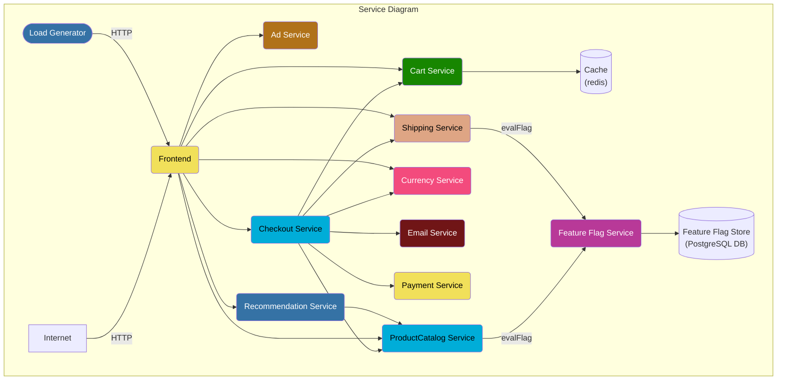
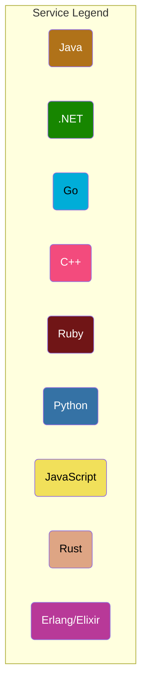

#  OpenTelemetry Demo

## Under Construction

This repo is a work in progress. If you'd like to help, check out our
[contributing guidance](#contributing).

## Getting Started

- [Docker](./docs/docker_deployment.md)
- [Kubernetes](./docs/kubernetes_deployment.md)

## Documentation

- [Demo Screenshots](./docs/demo_screenshots.md)
- [Feature Flags](./docs/feature_flags.md)
- [Manual Span Attributes](./docs/manual_span_attributes.md)
- [Metric Feature Coverage by Service](./docs/metric_service_features.md)
- [Requirements](./docs/requirements/README.md)
- [Service Roles](./docs/service_table.md)
- [Trace Feature Coverage by Service](./docs/trace_service_features.md)

## Architecture

**Online Boutique** is composed of microservices written in different programming
languages that talk to each other over gRPC. Plus one Load Generator which uses
[Locust](https://locust.io/) to fake user traffic.

Find the **Protocol Buffer Definitions** in the `/pb/` directory.

## Features

- **[Kubernetes](https://kubernetes.io)**: the app is designed to run on
  Kubernetes (both locally , as well as on the cloud).
- **[Docker](https://docs.docker.com)**: this forked sample can also be executed
  only with Docker.
- **[gRPC](https://grpc.io)**: microservices use a high volume of gRPC calls to
  communicate to each other.
- **[OpenTelemetry Traces](https://opentelemetry.io)**: all services are
  instrumented using OpenTelemetry available instrumentation libraries.
- **[OpenTelemetry
  Collector](https://opentelemetry.io/docs/collector/getting-started)**: all
  services are instrumented and sending the generated traces to the
  OpenTelemetry Collector via gRPC. The received traces are then exported to the
  logs and to Jaeger.
- **[Jaeger](https://www.jaegertracing.io)**: all generated traces are being
  sent to Jaeger.
- **Synthetic Load Generation**: the application demo comes with a background
  job that creates realistic usage patterns on the website using
  [Locust](https://locust.io/) load generator.
- **[Prometheus](https://prometheus.io/)**: all generated metrics are being
  sent to Prometheus.
- **[Grafana](https://grafana.com/)**: all metric dashboards are stored in Grafana.

## Demos featuring Online Boutique

- [Datadog](https://github.com/DataDog/opentelemetry-demo-webstore)
- [Honeycomb.io](https://github.com/honeycombio/opentelemetry-demo-webstore)
- [Lightstep](https://github.com/lightstep/opentelemetry-demo-webstore)

## Contributing

See [CONTRIBUTING.md](CONTRIBUTING.md)

We meet weekly Monday's at 8:15 AM PT. The meeting is subject to change
depending on contributors' availability. Check the [OpenTelemetry community
calendar](https://calendar.google.com/calendar/embed?src=google.com_b79e3e90j7bbsa2n2p5an5lf60%40group.calendar.google.com)
for specific dates and Zoom meeting links.

Meeting notes are available as a public [Google
doc](https://docs.google.com/document/d/16f-JOjKzLgWxULRxY8TmpM_FjlI1sthvKurnqFz9x98/edit).
For edit access, get in touch on
[Slack](https://cloud-native.slack.com/archives/C03B4CWV4DA).

[Maintainers](https://github.com/open-telemetry/community/blob/main/community-membership.md#maintainer)
([@open-telemetry/demo-maintainers](https://github.com/orgs/open-telemetry/teams/demo-maintainers)):

- [Austin Parker](https://github.com/austinlparker), Lightstep
- [Carter Socha](https://github.com/cartersocha), Microsoft
- [Morgan McLean](https://github.com/mtwo), Splunk
- [Pierre Tessier](https://github.com/puckpuck), Honeycomb

[Approvers](https://github.com/open-telemetry/community/blob/main/community-membership.md#approver)
([@open-telemetry/demo-approvers](https://github.com/orgs/open-telemetry/teams/demo-approvers)):

- [Juliano Costa](https://github.com/julianocosta89), Dynatrace
- [Michael Maxwell](https://github.com/mic-max), Microsoft
- [Mikko Viitanen](https://github.com/mviitane), Dynatrace
- [Penghan Wang](https://github.com/wph95), AppDynamics
- [Reiley Yang](https://github.com/reyang), Microsoft
- [Ziqi Zhao](https://github.com/fatsheep9146), Alibaba

### Thanks to all the people who have contributed

