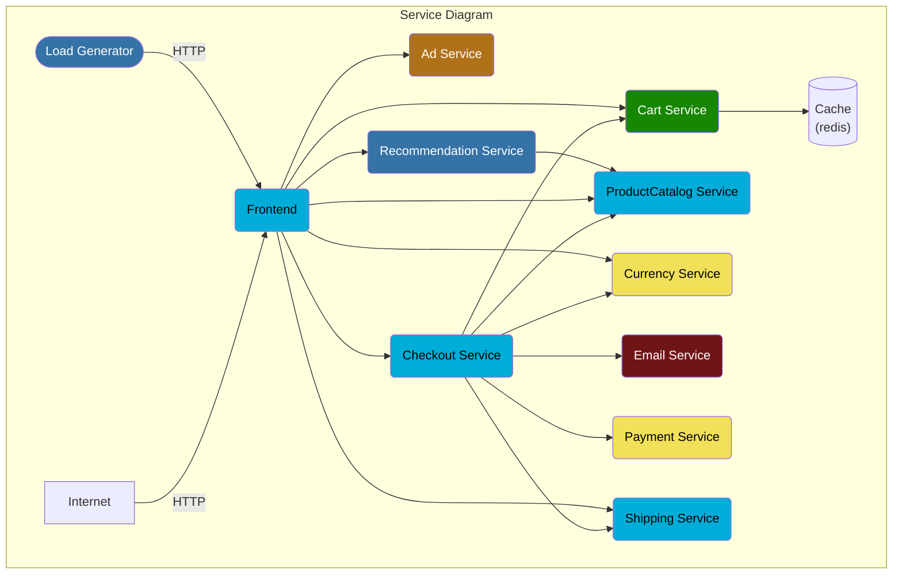
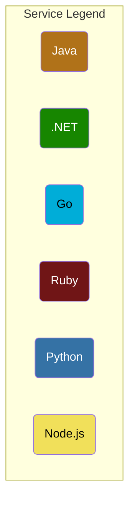

# Webstore Demo

## Under Construction

This repo is a work in progress. If you'd like to help, check out our
[contributing guidance](#contributing).

## Local Quickstart

### Pre-requisites

- Docker
- [Docker Compose](https://docs.docker.com/compose/install/#install-compose) v2.0.0+

### Clone Repo

- Clone the Webstore Demo repository:

```shell
git clone https://github.com/open-telemetry/opentelemetry-demo-webstore.git
```

### Open Folder

- Navigate to the cloned folder:

```shell
cd opentelemetry-demo-webstore/
```

### Run Docker Compose

- Start the demo (It can take ~20min the first time the command is executed as
all the images will be build):

```shell
docker compose up
```

### Verify the Webstore & the Telemetry

- Once the images are built you can access the Webstore at: <http://localhost:8080>

- And the Jaeger UI at: <http://localhost:16686>

### Bring your own backend

Likely you want to use the Webstore as a demo application for an observability
backend you already have (e.g. an existing instance of Jaeger, Zipkin or one of
the [vendor of your choice](https://opentelemetry.io/vendors/).

To add your backend open the file
[src/otelcollector/otelcol-config.yml](./src/otelcollector/otelcol-config.yml)
with an editor:

- add a trace exporter for your backend. For example, if your backend supports
  otlp, extend the `exporters` section like the following:

```yaml
exporters:
  jaeger:
    endpoint: "jaeger:14250"
    insecure: true
  logging:
  otlp:
    endpoint: <your-endpoint-url>
```

- add the `otlp` exporter to the `pipelines` section as well:

```yaml
service:
  pipelines:
    traces:
      receivers: [otlp]
      processors: [batch]
      exporters: [logging, jaeger, otlp]
```

Vendor backends might require you to add additional parameters for
authentication, please check their documentation. Some backends require
different exporters, you may find them and their documentation available at
[opentelemetry-collector-contrib/exporter](https://github.com/open-telemetry/opentelemetry-collector-contrib/tree/main/exporter).

After updating the `otelcol-config.yml` start the demo by running
`docker compose up`. After a while you should see the traces flowing into
your backend as well.

## Screenshots from the Online Boutique

| Home Page                                                                                                         | Checkout Screen                                                                                                    |
| ----------------------------------------------------------------------------------------------------------------- | ------------------------------------------------------------------------------------------------------------------ |
| [](./docs/img/online-boutique-frontend-1.png) | [](./docs/img/online-boutique-frontend-2.png) |

## Screenshots from Jaeger

| Jaeger UI                                                                                                         | Trace View                                                                                                    |
| ----------------------------------------------------------------------------------------------------------------- | ------------------------------------------------------------------------------------------------------------------ |
| [](./docs/img/jaeger-ui.png) | [](./docs/img/jaeger-trace-view.png) |

## Architecture

**Online Boutique** is composed of 10 microservices written in different
languages that talk to each other over gRPC. Plus one Load Generator which uses
Locust to fake user traffic.





_To view a graph of the desired state of this application [click here](./docs/v1Graph.md)_

Find **Protocol Buffers Descriptions** at the [`./pb` directory](./pb/README.md).

| Service                                              | Language      | Description                                                                                                                       |
| ---------------------------------------------------- | ------------- | --------------------------------------------------------------------------------------------------------------------------------- |
| [frontend](./src/frontend/README.md)                           | Go            | Exposes an HTTP server to serve the website. Does not require signup/login and generates session IDs for all users automatically. |
| [cartservice](./src/cartservice/README.md)                     | C#            | Stores the items in the user's shopping cart in Redis and retrieves it.                                                           |
| [productcatalogservice](./src/productcatalogservice/README.md) | Go            | Provides the list of products from a JSON file and ability to search products and get individual products.                        |
| [currencyservice](./src/currencyservice/README.md)             | Node.js       | Converts one money amount to another currency. Uses real values fetched from European Central Bank. It's the highest QPS service. |
| [paymentservice](./src/paymentservice/README.md)               | Node.js       | Charges the given credit card info (mock) with the given amount and returns a transaction ID.                                     |
| [shippingservice](./src/shippingservice/README.md)             | Go            | Gives shipping cost estimates based on the shopping cart. Ships items to the given address (mock)                                 |
| [emailservice](./src/emailservice/README.md)                   | Ruby        | Sends users an order confirmation email (mock).                                                                                   |
| [checkoutservice](./src/checkoutservice/README.md)             | Go            | Retrieves user cart, prepares order and orchestrates the payment, shipping and the email notification.                            |
| [recommendationservice](./src/recommendationservice/README.md) | Python        | Recommends other products based on what's given in the cart.                                                                      |
| [adservice](./src/adservice/README.md)                         | Java          | Provides text ads based on given context words.                                                                                   |
| [loadgenerator](./src/loadgenerator/README.md)                 | Python/Locust | Continuously sends requests imitating realistic user shopping flows to the frontend.                                              |

## Features

- **[Kubernetes](https://kubernetes.io):**  
  The app is designed to run on Kubernetes (both locally , as well as on the cloud).
- **[Docker](https://docs.docker.com):**  
  This forked sample can also be executed only with Docker.
- **[gRPC](https://grpc.io):**  
  Microservices use a high volume of gRPC calls to communicate to each other.
- **[OpenTelemetry Traces](https://opentelemetry.io):**  
  All services are instrumented using OpenTelemetry available instrumentation libraries.
- **[OpenTelemetry Collector](https://opentelemetry.io/docs/collector/getting-started):**
  All services are instrumented and sending the generated traces to the
  OpenTelemetry Collector via gRPC. The received traces are then exported to the
  logs and to Jaeger.
- **[Jaeger](https://www.jaegertracing.io):**  
  All generated traces are being sent to Jaeger.
- **Synthetic Load Generation:**  
  The application demo comes with a background job that creates realistic usage
  patterns on the website using [Locust](https://locust.io/) load generator.

## Demos featuring Online Boutique

TBD

## Contributing

See [CONTRIBUTING.md](CONTRIBUTING.md)

We meet weekly Monday's at 8:15 AM PT. The meeting is subject to change
depending on contributors' availability. Check the [OpenTelemetry community
calendar](https://calendar.google.com/calendar/embed?src=google.com_b79e3e90j7bbsa2n2p5an5lf60%40group.calendar.google.com)
for specific dates and Zoom meeting links.

Meeting notes are available as a public [Google
doc](https://docs.google.com/document/d/16f-JOjKzLgWxULRxY8TmpM_FjlI1sthvKurnqFz9x98/edit).
For edit access, get in touch on
[Slack](https://cloud-native.slack.com/archives/C03B4CWV4DA).

[Maintainers](https://github.com/open-telemetry/community/blob/main/community-membership.md#maintainer)
([@open-telemetry/demo-webstore-maintainers](https://github.com/orgs/open-telemetry/teams/demo-webstore-maintainers)):

- [Austin Parker](https://github.com/austinlparker), Lightstep
- [Carter Socha](https://github.com/cartersocha), Microsoft
- [Morgan McLean](https://github.com/mtwo), Splunk

[Approvers](https://github.com/open-telemetry/community/blob/main/community-membership.md#approver)
([@open-telemetry/demo-webstore-approvers](https://github.com/orgs/open-telemetry/teams/demo-webstore-approvers)):

- [Joe Sirianni](https://github.com/jsirianni), ObservIQ
- [Juliano Costa](https://github.com/julianocosta89), Dynatrace
- [Michael Maxwell](https://github.com/mic-max), Microsoft
- [Reiley Yang](https://github.com/reyang), Microsoft

### Thanks to all the people who have contributed

[](https://github.com/open-telemetry/opentelemetry-demo-webstore/graphs/contributors)
