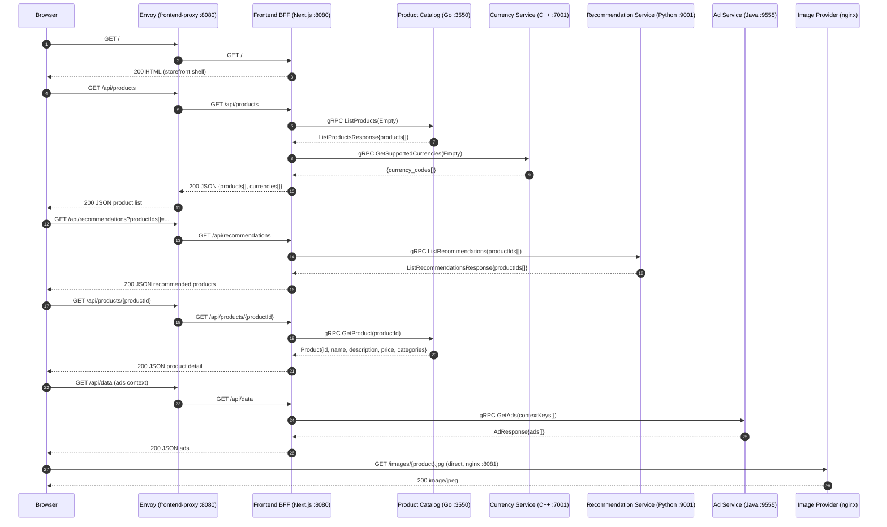
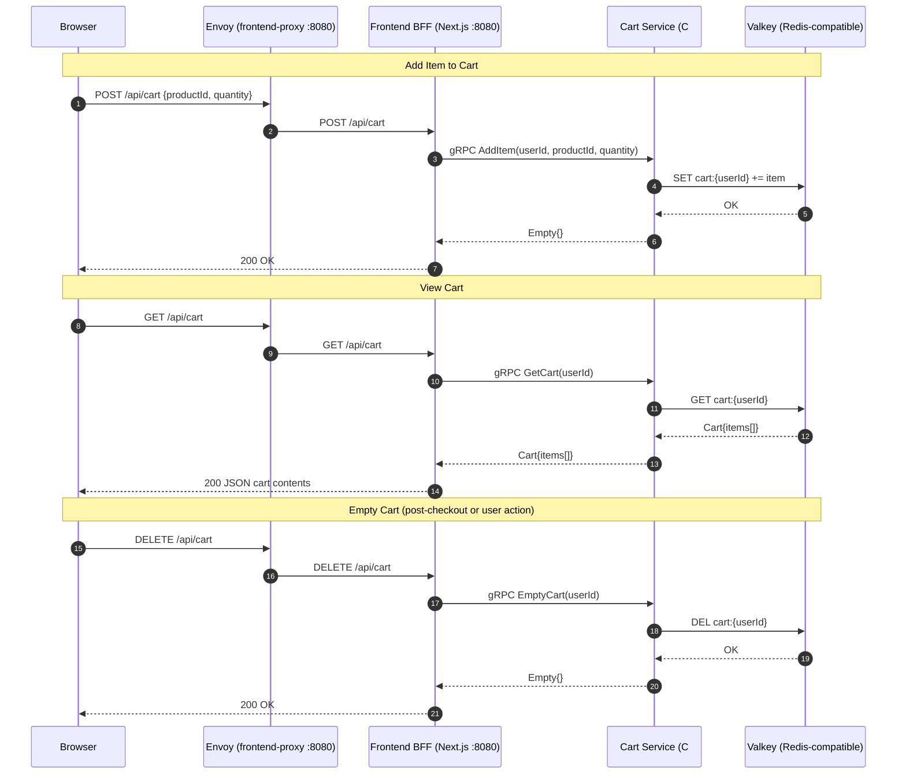
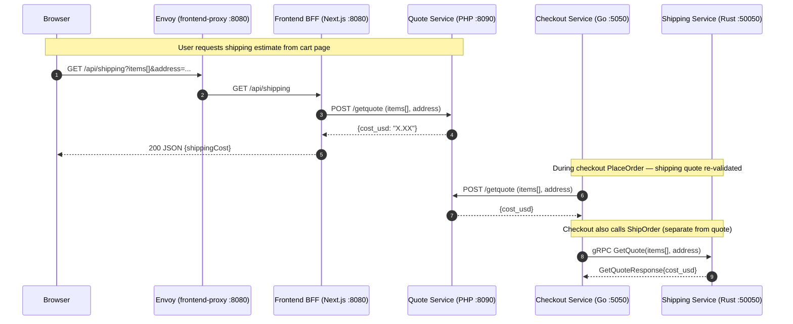
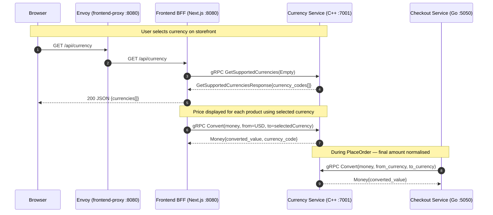
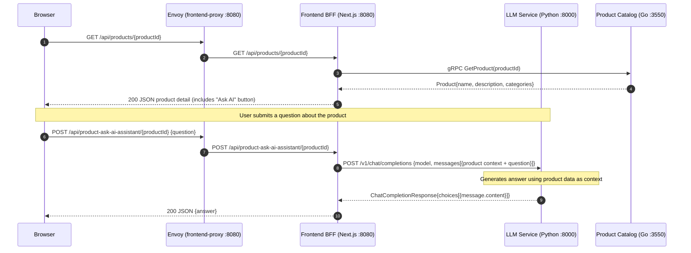
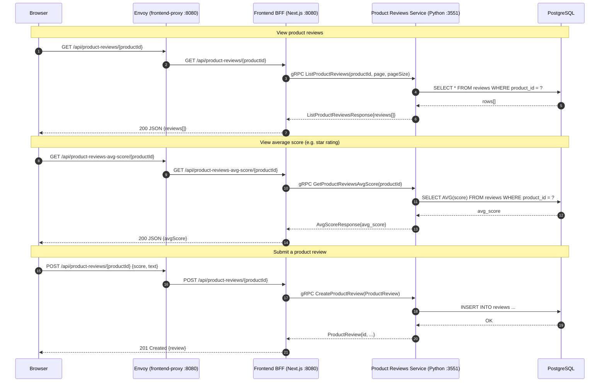

# Critical User Paths Analysis — Astronomy Shop

> **Role:** Senior Product Architect  
> **Source:** `doc/endpoint.csv`, `doc/endpoint_summary.md`, `doc/application-overview.md`  
> **Date:** March 2026

---

## Executive Summary

Eight Critical User Paths (CUPs) have been identified across the Astronomy Shop platform. They are ordered by business criticality — defined as the revenue or reputational impact of downtime on that path.

| Priority | Critical User Path | Business Impact | Services Involved |
|---|---|---|---|
| 1 | **Checkout & Payment** | Direct revenue loss; every minute of downtime loses sales | frontend, checkout, payment, cart, currency, shipping, email, kafka |
| 2 | **Product Browse & Discovery** | Top-of-funnel; broken browsing stops all conversions | frontend, product-catalog, recommendation, ad, currency |
| 3 | **Shopping Cart Management** | Mid-funnel; users cannot build orders without a working cart | frontend, cart |
| 4 | **Order Fulfillment & Fraud Detection** | Post-purchase trust; failed fulfillment causes customer churn | checkout, kafka, accounting, fraud-detection, shipping, email |
| 5 | **Shipping Quote** | Purchase decision gate; missing quotes block checkout completion | frontend, quote, shipping |
| 6 | **Currency Selection & Price Display** | Global commerce; all prices break for non-USD users if currency service fails | frontend, currency |
| 7 | **AI Product Assistant** | Conversion aid; downtime degrades product discovery and Q&A | frontend, llm, product-catalog |
| 8 | **Product Reviews** | Trust signal; downtime reduces purchase confidence but does not block transactions | frontend, product-reviews, postgresql |

---

## CUP 1 — Checkout & Payment

### Why It Is Critical
This is the **sole revenue-generating path** in the application. Any downtime directly blocks purchases. The path spans the most services (8+) and handles sensitive payment card data (PAN + CVV) via gRPC. A failure at any step — payment charge, cart read, currency conversion — aborts the entire order.

### Sequence Diagram

```mermaid
sequenceDiagram
    autonumber
    participant Browser
    participant Envoy as Envoy (frontend-proxy :8080)
    participant FE as Frontend BFF (Next.js :8080)
    participant Checkout as Checkout Service (Go :5050)
    participant Cart as Cart Service (C# :7070)
    participant Currency as Currency Service (C++ :7001)
    participant Quote as Quote Service (PHP :8090)
    participant Payment as Payment Service (Node.js :50051)
    participant Shipping as Shipping Service (Rust :50050)
    participant Email as Email Service (Ruby :6060)
    participant Kafka as Kafka Broker
    participant Accounting as Accounting Service (C#)
    participant Fraud as Fraud Detection (Kotlin)

    Browser->>Envoy: POST /api/checkout (order form payload)
    Envoy->>FE: POST /api/checkout
    Note over FE: Validates request; builds PlaceOrderRequest
    FE->>Checkout: gRPC PlaceOrder(PlaceOrderRequest)

    Checkout->>Cart: gRPC GetCart(userId)
    Cart-->>Checkout: Cart{items[]}

    Checkout->>Currency: gRPC Convert(amount, from_currency, to_currency)
    Currency-->>Checkout: Money{converted_amount}

    Checkout->>Quote: POST /getquote (items[], address)
    Quote-->>Checkout: {cost_usd}

    Note over Checkout,Payment: ⚠️ Card data (PAN+CVV) transmitted — must not appear in trace attributes
    Checkout->>Payment: gRPC Charge(CreditCardInfo, amount)
    Payment-->>Checkout: ChargeResult{transaction_id}

    Checkout->>Shipping: gRPC ShipOrder(address, items[])
    Shipping-->>Checkout: ShipOrderResult{tracking_id}

    Checkout->>Email: gRPC SendOrderConfirmation(order)
    Email-->>Checkout: Empty{}

    Checkout->>Cart: gRPC EmptyCart(userId)
    Cart-->>Checkout: Empty{}

    Checkout->>Kafka: Publish orders topic (OrderPlacedEvent)
    Note over Kafka: Async — does not block response

    Checkout-->>FE: PlaceOrderResponse{order_id, tracking_id}
    FE-->>Envoy: 200 OK {orderId, trackingId}
    Envoy-->>Browser: 200 OK {orderId, trackingId}
    Note over Browser: Redirect to /cart/checkout/{orderId}

    par Async Consumers
        Kafka-->>Accounting: OrderPlacedEvent (audit ledger)
    and
        Kafka-->>Fraud: OrderPlacedEvent (risk scoring)
    end
```

### Endpoint Table

| Why Critical | Functionality | HTTP Method | File Path | Folder |
|---|---|---|---|---|
| Entry point for all purchases | Receives order form from browser; delegates to checkout gRPC | POST | `src/frontend/pages/api/checkout.ts` | frontend |
| Orchestrates all downstream calls | Coordinates cart read, currency convert, quote, payment, shipping, email, Kafka publish | gRPC `PlaceOrder` | `src/checkout/main.go` | checkout |
| Reads order items | Retrieves cart contents for the order | gRPC `GetCart` | `src/cart/src/services/CartService.cs` | cart |
| Clears cart post-purchase | Empties cart after successful order | gRPC `EmptyCart` | `src/cart/src/services/CartService.cs` | cart |
| Price normalisation | Converts all money values to consistent currency | gRPC `Convert` | `src/currency/src/currency_service.cc` | currency |
| Cost estimate for order | Calculates shipping cost included in total | POST `/getquote` | `src/quote/quote.php` | quote |
| **Revenue — direct payment capture** | Charges credit card; returns transaction ID | gRPC `Charge` | `src/payment/charge.js` | payment |
| Logistics fulfilment | Creates shipping order; returns tracking ID | gRPC `ShipOrder` | `src/shipping/src/main.rs` | shipping |
| Customer communication | Sends HTML order confirmation email | gRPC `SendOrderConfirmation` | `src/email/email_server.rb` | email |
| Audit trail | Publishes `OrderPlacedEvent` to Kafka for accounting | Kafka publish | `src/checkout/kafka/producer.go` | checkout |
| Fraud risk scoring | Consumes `OrderPlacedEvent`; evaluates fraud risk | Kafka consume | `src/fraud-detection/src/` | fraud-detection |
| Audit ledger | Consumes `OrderPlacedEvent`; records financial transactions | Kafka consume | `src/accounting/Consumer.cs` | accounting |

---

## CUP 2 — Product Browse & Discovery

### Why It Is Critical
This is the **top-of-funnel path**. If users cannot browse the catalogue, recommendations fail, and the entire purchase funnel is blocked. All conversions depend on this path working correctly.

### Sequence Diagram



### Endpoint Table

| Why Critical | Functionality | HTTP Method | File Path | Folder |
|---|---|---|---|---|
| Top-of-funnel entry | Serves storefront HTML shell | GET `/` | `src/frontend/pages/index.tsx` | frontend |
| Product catalogue display | Lists all products with prices | GET `/api/products` | `src/frontend/pages/api/products/index.ts` | frontend |
| Product detail page | Returns full product information | GET `/api/products/[productId]` | `src/frontend/pages/api/products/[productId]/index.ts` | frontend |
| Product data source | Serves product catalogue from JSON files | gRPC `ListProducts`, `GetProduct` | `src/product-catalog/main.go` | product-catalog |
| Currency display | Returns supported currency codes for price selector | gRPC `GetSupportedCurrencies` | `src/currency/src/currency_service.cc` | currency |
| Engagement / cross-sell | Returns personalised product recommendations | GET `/api/recommendations` | `src/frontend/pages/api/recommendations.ts` | frontend |
| Recommendation engine | Computes recommended products excluding cart items | gRPC `ListRecommendations` | `src/recommendation/recommendation_server.py` | recommendation |
| Monetisation via ads | Returns contextual ads for product categories | GET `/api/data` | `src/frontend/pages/api/data.ts` | frontend |
| Ad targeting | Matches ads to product category context keys | gRPC `GetAds` | `src/ad/src/main/java/oteldemo/AdService.java` | ad |
| Visual product content | Serves product images for catalogue display | GET `/images/*` | `src/image-provider/nginx.conf.template` | image-provider |

---

## CUP 3 — Shopping Cart Management

### Why It Is Critical
The cart is the **bridge between browsing and purchase**. Users build their intent here. If the cart is unavailable, no checkout can occur regardless of the state of other services. It also stores session state in Valkey (Redis), making it a stateful dependency.

### Sequence Diagram



### Endpoint Table

| Why Critical | Functionality | HTTP Method | File Path | Folder |
|---|---|---|---|---|
| Add-to-cart action | Adds a product + quantity to the user's cart | POST `/api/cart` | `src/frontend/pages/api/cart.ts` | frontend |
| Cart state read | Returns all cart items for checkout and display | GET `/api/cart` | `src/frontend/pages/api/cart.ts` | frontend |
| Cart reset | Clears cart after checkout or on user request | DELETE `/api/cart` | `src/frontend/pages/api/cart.ts` | frontend |
| Cart state storage — AddItem | Persists item to Valkey | gRPC `AddItem` | `src/cart/src/services/CartService.cs` | cart |
| Cart state read — GetCart | Retrieves all items from Valkey for given user | gRPC `GetCart` | `src/cart/src/services/CartService.cs` | cart |
| Cart state reset — EmptyCart | Deletes cart from Valkey; called by checkout and delete API | gRPC `EmptyCart` | `src/cart/src/services/CartService.cs` | cart |

---

## CUP 4 — Order Fulfillment & Fraud Detection

### Why It Is Critical
This path governs **post-purchase trust and compliance**. Failed fulfilment results in customer complaints and refunds. Missing fraud detection creates financial risk. These flows run asynchronously via Kafka after the checkout response, so they do not block the purchase but are critical for business operations.

### Sequence Diagram

```mermaid
sequenceDiagram
    autonumber
    participant Checkout as Checkout Service (Go)
    participant Kafka as Kafka Broker (:9092)
    participant Accounting as Accounting Service (C#)
    participant FraudDet as Fraud Detection (Kotlin)
    participant Shipping as Shipping Service (Rust :50050)
    participant Email as Email Service (Ruby :6060)

    Note over Checkout,Kafka: After PlaceOrder completes — async publish
    Checkout->>Kafka: Publish topic=orders (OrderPlacedEvent{orderId, items, amount})

    par Parallel async consumers
        Kafka-->>Accounting: Consume OrderPlacedEvent
        Note over Accounting: Records financial transaction in audit ledger
        Accounting-->>Accounting: Persist to accounting store
    and
        Kafka-->>FraudDet: Consume OrderPlacedEvent
        Note over FraudDet: Scores risk; flags suspicious orders
        FraudDet-->>FraudDet: Emit fraud risk assessment span
    end

    Note over Checkout,Email: Sync within PlaceOrder (before Kafka publish)
    Checkout->>Shipping: gRPC ShipOrder(address, items[])
    Shipping-->>Checkout: ShipOrderResult{tracking_id}

    Checkout->>Email: gRPC SendOrderConfirmation(email, order, tracking_id)
    Email-->>Checkout: Empty{}
    Note over Email: Renders HTML email via ERB template; sends via SMTP
```

### Endpoint Table

| Why Critical | Functionality | HTTP Method | File Path | Folder |
|---|---|---|---|---|
| Logistics fulfilment | Creates physical shipment; returns tracking ID | gRPC `ShipOrder` | `src/shipping/src/main.rs` | shipping |
| Customer communication | Sends order confirmation email with tracking | gRPC `SendOrderConfirmation` | `src/email/email_server.rb` | email |
| Async order event publish | Publishes `OrderPlacedEvent` to Kafka `orders` topic | Kafka produce | `src/checkout/kafka/producer.go` | checkout |
| Financial audit | Consumes order events; writes to accounting ledger | Kafka consume | `src/accounting/Consumer.cs` | accounting |
| Fraud risk scoring | Consumes order events; assesses fraud risk per transaction | Kafka consume | `src/fraud-detection/src/` | fraud-detection |

---

## CUP 5 — Shipping Quote

### Why It Is Critical
The shipping cost is a **key purchase decision factor**. If the quote service is unavailable, checkout cannot complete because `PlaceOrder` calls `/getquote` synchronously. It is a blocking dependency in CUP 1.

### Sequence Diagram



### Endpoint Table

| Why Critical | Functionality | HTTP Method | File Path | Folder |
|---|---|---|---|---|
| Shipping cost display on cart page | Returns estimated shipping cost to browser | GET `/api/shipping` | `src/frontend/pages/api/shipping.ts` | frontend |
| Quote calculation — blocking checkout | Calculates shipping cost; called synchronously in PlaceOrder | POST `/getquote` | `src/quote/quote.php` | quote |
| Quote validation via gRPC | Secondary quote via gRPC ShippingService | gRPC `GetQuote` | `src/shipping/src/main.rs` | shipping |

---

## CUP 6 — Currency Selection & Price Display

### Why It Is Critical
All product prices and the checkout total depend on the currency service. If it is down, **no prices can be displayed or converted**, breaking both browse and checkout for non-USD users. The service is called on every product page load.

### Sequence Diagram



### Endpoint Table

| Why Critical | Functionality | HTTP Method | File Path | Folder |
|---|---|---|---|---|
| Currency selector | Returns all supported ISO-4217 currency codes | GET `/api/currency` | `src/frontend/pages/api/currency.ts` | frontend |
| Currency list for display | Lists supported currencies for the UI dropdown | gRPC `GetSupportedCurrencies` | `src/currency/src/currency_service.cc` | currency |
| Price conversion | Converts product prices to the selected currency | gRPC `Convert` | `src/currency/src/currency_service.cc` | currency |

---

## CUP 7 — AI Product Assistant

### Why It Is Critical
The AI assistant is a **conversion aid** that helps users make product decisions. Downtime does not block purchases but degrades the discovery experience. It is a differentiating feature; extended downtime reduces engagement and conversion rates.

### Sequence Diagram



### Endpoint Table

| Why Critical | Functionality | HTTP Method | File Path | Folder |
|---|---|---|---|---|
| AI Q&A entry point | Receives user question about a product; calls LLM service | POST `/api/product-ask-ai-assistant/[productId]` | `src/frontend/pages/api/product-ask-ai-assistant/[productId]/index.ts` | frontend |
| Product context provider | Provides product description as LLM context | gRPC `GetProduct` | `src/product-catalog/main.go` | product-catalog |
| Answer generation | Calls OpenAI-compatible API; returns natural language answer | POST `/v1/chat/completions` | `src/llm/app.py` | llm |

---

## CUP 8 — Product Reviews

### Why It Is Critical
Product reviews are a **social proof and trust signal** that influence purchasing decisions. While downtime does not block transactions, it reduces the quality of product information available to users and can suppress conversion rates.

### Sequence Diagram



### Endpoint Table

| Why Critical | Functionality | HTTP Method | File Path | Folder |
|---|---|---|---|---|
| Review list display | Returns all reviews for a product | GET `/api/product-reviews/[productId]` | `src/frontend/pages/api/product-reviews/[productId]/index.ts` | frontend |
| Average star rating | Returns average review score for display | GET `/api/product-reviews-avg-score/[productId]` | `src/frontend/pages/api/product-reviews-avg-score/[productId]/index.ts` | frontend |
| Review submission | Creates a new review | POST `/api/product-reviews/[productId]` | `src/frontend/pages/api/product-reviews/[productId]/index.ts` | frontend |
| Review data service | Reads/writes reviews from/to PostgreSQL | gRPC `ListProductReviews`, `CreateProductReview` | `src/product-reviews/product_reviews_server.py` | product-reviews |
| Review data persistence | Stores review records | SQL queries | `src/postgresql/init.sql` | postgresql |

---

## Summary: Service Criticality Across CUPs

| Folder | CUPs Involved | Criticality |
|---|---|---|
| `frontend` | 1, 2, 3, 4, 5, 6, 7, 8 | 🔴 **Highest** — every CUP passes through the BFF |
| `frontend-proxy` | 1, 2, 3, 4, 5, 6, 7, 8 | 🔴 **Highest** — sole external ingress |
| `checkout` | 1, 4, 5 | 🔴 **Highest** — orchestrates payment, fulfilment, and Kafka |
| `payment` | 1 | 🔴 **Highest** — direct revenue path; card data handling |
| `cart` | 1, 3 | 🔴 **High** — blocks checkout if unavailable |
| `currency` | 1, 2, 6 | 🔴 **High** — all prices depend on it |
| `product-catalog` | 2, 7 | 🟠 **High** — browse and AI assistant require it |
| `quote` | 1, 5 | 🟠 **High** — blocks checkout synchronously |
| `shipping` | 1, 4, 5 | 🟠 **High** — fulfilment and quote both depend on it |
| `email` | 1, 4 | 🟡 **Medium** — post-purchase communication |
| `kafka` | 1, 4 | 🟡 **Medium** — async; does not block purchase but critical for compliance |
| `accounting` | 4 | 🟡 **Medium** — financial audit compliance |
| `fraud-detection` | 4 | 🟡 **Medium** — financial risk control |
| `recommendation` | 2 | 🟡 **Medium** — engagement; degrades gracefully |
| `ad` | 2 | 🟢 **Lower** — monetisation; does not block purchase |
| `llm` | 7 | 🟢 **Lower** — feature enhancement; gracefully degradable |
| `product-reviews` | 8 | 🟢 **Lower** — trust signal; does not block purchase |
| `postgresql` | 8 | 🟢 **Lower** — supports reviews only |
| `image-provider` | 2 | 🟢 **Lower** — static assets; CDN can substitute |