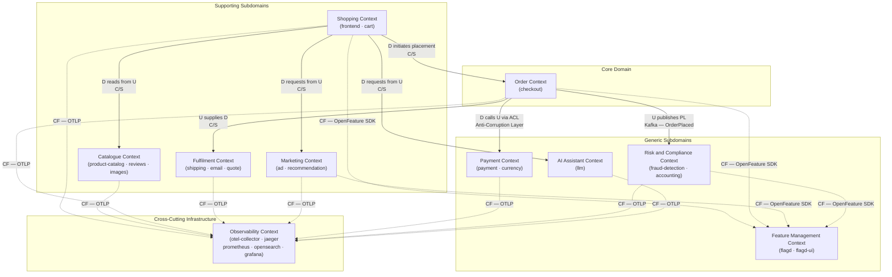
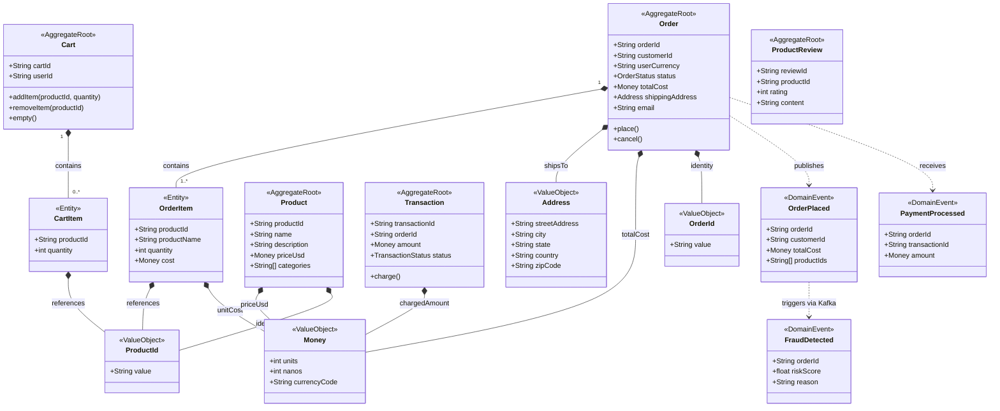

# Astronomy Shop – Domain-Driven Design Analysis

> **Reference:** [`doc/application-overview.md`](application-overview.md)  
> **Role:** Expert Software Architect — Domain-Driven Design, System Architecture

---

## Step 1: DDD Analysis

### 1.1 Core Domain & Subdomains

| Type | Subdomain | Description |
|---|---|---|
| **Core Domain** | **Order Management** | The primary business differentiator. Orchestrates the full purchase lifecycle: cart → checkout → payment → fulfilment. This is where competitive value lives. |
| Supporting | Catalogue & Discovery | Product catalogue, search, recommendations, and ad serving. Supports conversion but does not itself process orders. |
| Supporting | Customer Engagement | Reviews, LLM-powered product Q&A, personalisation. Enhances experience but is replaceable. |
| Supporting | Fulfilment & Notifications | Shipping quote calculation, order confirmation emails. Executes post-order obligations. |
| Generic | Payment Processing | Credit card charging and currency conversion. Off-the-shelf concern; no competitive advantage. |
| Generic | Risk & Compliance | Fraud detection and financial accounting. Regulatory/operational necessity. |
| Generic | Feature Management | Feature flag evaluation (FlagD/OpenFeature). Enables safe deployments and chaos testing. |
| Generic | Observability | Distributed tracing, metrics, log aggregation. Engineering infrastructure concern. |

---

### 1.2 Ubiquitous Language

| Term | Definition |
|---|---|
| **Order** | A confirmed intent to purchase one or more Products, including shipping details, payment information, and a unique identity. An Order is immutable once placed. |
| **Cart** | A mutable, session-scoped collection of Cart Items assembled by a Customer prior to placing an Order. |
| **Product** | A catalogued item available for sale (e.g., a telescope), described by name, price, and category. |
| **Placement** | The business act of a Customer converting a Cart into an Order, triggering payment, fulfilment, and risk checks simultaneously. |
| **Quote** | A calculated shipping cost estimate for a given Cart and destination Address, valid for the duration of checkout. |
| **Fulfilment** | The downstream process that begins after Placement: computing the final shipping cost, dispatching a confirmation email, and updating financial ledgers. |

---

### 1.3 Bounded Contexts

| Bounded Context | Microservices | Responsibility |
|---|---|---|
| **Shopping** | frontend (BFF), cart | Cart lifecycle management; product browsing experience; user session |
| **Catalogue** | product-catalog, product-reviews, image-provider | Product data ownership; images; customer reviews |
| **Order** | checkout | Order aggregate creation; placement orchestration |
| **Payment** | payment, currency | Card charging; multi-currency price conversion |
| **Fulfilment** | shipping, email, quote | Shipping cost calculation; order confirmation delivery |
| **Risk & Compliance** | fraud-detection, accounting | Fraud risk scoring; financial ledger recording |
| **Marketing** | ad, recommendation | Contextual ad selection; product recommendations |
| **AI Assistant** | llm | Natural language Q&A about products |
| **Feature Management** | flagd, flagd-ui | Feature flag evaluation; fault injection control |
| **Observability** | otel-collector, jaeger, prometheus, opensearch, grafana | Cross-cutting telemetry pipeline |

---

### 1.4 Aggregates & Entities

#### Order Context

| Aggregate Root | Entities | Invariants |
|---|---|---|
| **Order** | OrderItem (per line item) | Total cost = sum of (OrderItem.unitCost × quantity); status transitions are one-way |

#### Shopping Context

| Aggregate Root | Entities | Invariants |
|---|---|---|
| **Cart** | CartItem (per product added) | A CartItem quantity must be ≥ 1; Cart belongs to exactly one session/user |

#### Catalogue Context

| Aggregate Root | Entities | Invariants |
|---|---|---|
| **Product** | ProductCategory (association) | Price must be ≥ 0; ProductId is globally unique |
| **ProductReview** | — | Rating must be 1–5; tied to a valid ProductId |

#### Payment Context

| Aggregate Root | Entities |
|---|---|
| **Transaction** | CreditCardInfo (transient, never persisted) |

---

### 1.5 Value Objects

| Value Object | Attributes | Context |
|---|---|---|
| **Money** | `units: int`, `nanos: int`, `currencyCode: string` | Order, Cart, Product |
| **Address** | `streetAddress`, `city`, `state`, `country`, `zipCode` | Order (shipping) |
| **OrderId** | `string UUID` | Order, Fulfilment, Risk |
| **ProductId** | `string` | Cart, Order, Catalogue |
| **CreditCard** | `number`, `cvv`, `expiryMonth`, `expiryYear` | Payment (transient) |
| **Quote** | `costUsd: Money`, `validUntil: timestamp` | Fulfilment |

---

### 1.6 Domain Events

| Event | Publisher | Consumers | Trigger |
|---|---|---|---|
| **OrderPlaced** | Order Context (checkout) | Risk Context (fraud-detection), Risk Context (accounting) | Cart successfully converted to Order, payment authorised |
| **PaymentProcessed** | Payment Context | Order Context | Card successfully charged; `transactionId` returned |
| **PaymentFailed** | Payment Context | Order Context, Shopping Context | Card declined or gateway error |
| **FraudDetected** | Risk Context | Order Context (future: order hold) | Fraud score exceeds threshold |
| **CartAbandoned** | Shopping Context | Marketing Context | Session expires with non-empty Cart |
| **QuoteCalculated** | Fulfilment Context | Order Context | Shipping quote returned for given items + address |

---

## Step 2: Diagrams

### 2.1 Context Map

Notation:
- **U/D** = Upstream / Downstream
- **C/S** = Customer / Supplier
- **ACL** = Anti-Corruption Layer
- **PL** = Published Language (Kafka events)
- **CF** = Conformist
- **OHS** = Open Host Service

---

### 2.2 Aggregate and Entity Diagram (Core Domain)

---

## 3. Integration Patterns Summary

| Pattern | Where Applied | Rationale |
|---|---|---|
| **Customer / Supplier** | Shopping → Catalogue, Marketing, Order; Order → Fulfilment | Shopping and Order drive requirements; upstream services must honour contracts |
| **Anti-Corruption Layer (ACL)** | Order → Payment | Insulates the core Order domain model from external payment gateway semantics (Stripe-style API) |
| **Published Language (Kafka)** | Order → Risk & Compliance | `OrderPlaced` is a stable, versioned event schema broadcast over Kafka; consumers are fully decoupled from Order internals |
| **Conformist** | All → Feature Management (FlagD), All → Observability | Services adopt the flag evaluation API and OTLP protocol as-is; no translation layer |
| **Open Host Service** | Catalogue, Payment, Fulfilment | Services expose well-defined gRPC/HTTP interfaces consumed by multiple upstream callers |
| **Shared Kernel** | Proto definitions in `pb/demo.proto` | gRPC protobuf contracts are shared across all contexts; changes require coordination |

---

## 4. Strategic Design Recommendations

1. **Protect the Order Context boundary.** The `checkout` service already acts as the core aggregate factory. Avoid letting the `frontend` BFF embed order-placement logic — keep it in the Order Context.

2. **Event-source the Order lifecycle.** Publishing `OrderPlaced`, `PaymentProcessed`, `FulfilmentDispatched` as immutable events (beyond Kafka) would enable temporal queries, audit trails, and replay — currently absent.

3. **Strengthen the Payment ACL.** The `payment` service maps external card-gateway responses into domain-neutral `TransactionResult` objects. Ensure no gateway-specific error codes leak into the Order aggregate.

4. **Model Cart expiry as a Domain Event.** `CartAbandoned` is a meaningful business signal (re-engagement campaigns). Currently the cart TTL in Valkey silently discards state — surface this as a published event.

5. **Formalise the Catalogue → Order contract.** When `checkout` reads product prices, it should snapshot them into `OrderItem.cost` at placement time. Product price changes must not retroactively alter placed Orders.