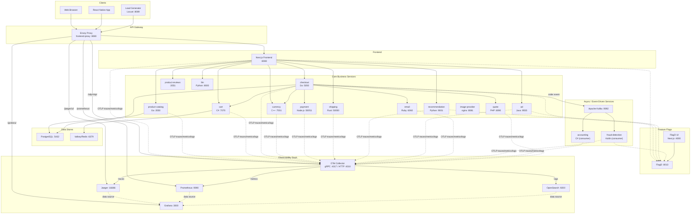
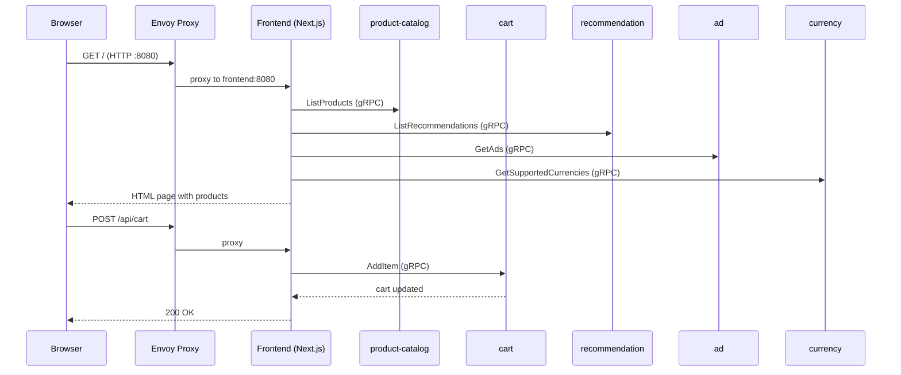
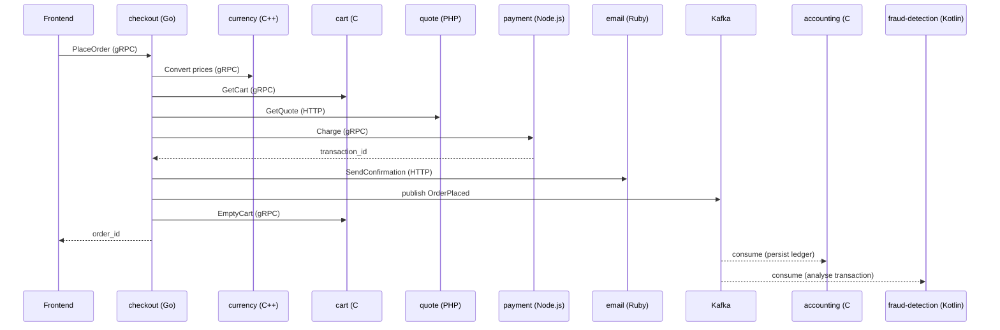
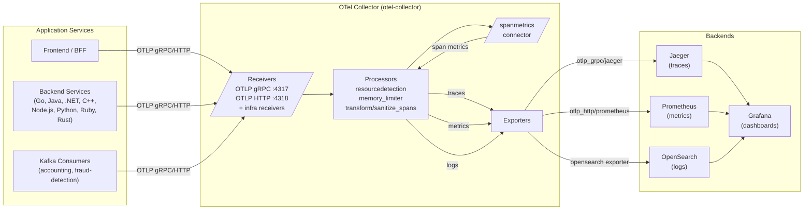
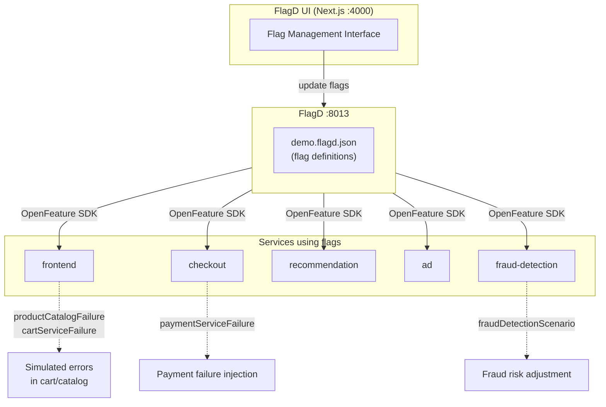

# Astronomy Shop – System Overview

> **Project:** OpenTelemetry Demo (`opentelemetry-demo`)  
> **Purpose:** A fully instrumented, polyglot microservices e-commerce application for an astronomy/telescope shop, used as the official reference implementation for OpenTelemetry.

---

## 1. System Overview

The Astronomy Shop is a cloud-native, microservices-based e-commerce platform built entirely to demonstrate OpenTelemetry instrumentation across every major programming language and framework. It simulates a real-world online shop selling telescopes, cameras, and astronomy accessories.

Every service is instrumented with the OpenTelemetry SDK for its language and ships traces, metrics, and logs to a central OpenTelemetry Collector, which fans out to Jaeger (traces), Prometheus (metrics), OpenSearch (logs), and Grafana (dashboards).

The system is deployable via **Docker Compose** (local development) or **Kubernetes** (production-like).

---

## 2. Business Purpose

| Capability | Description |
|---|---|
| **Product browsing** | Browse telescope/astronomy product catalogue with images and recommendations |
| **Shopping cart** | Add items to a persistent cart backed by Valkey (Redis-compatible) |
| **Checkout & payment** | End-to-end checkout flow with currency conversion and credit card processing |
| **Order fulfilment** | Shipping quote calculation and order confirmation via email |
| **Fraud detection** | Real-time transaction fraud analysis via Kafka event stream |
| **Recommendations** | AI-assisted product recommendations |
| **LLM assistant** | Natural language product Q&A powered by an LLM |
| **Feature flags** | Runtime fault injection via FlagD for chaos/resilience testing |
| **Observability** | Full distributed tracing, metrics, and structured logging across all services |

---

## 3. Technology Stack

| Category | Technologies |
|---|---|
| **Languages** | Go, Java, Kotlin, C#/.NET, C++, Node.js, Python, Ruby, PHP, TypeScript, Rust |
| **Frontend** | Next.js 14 (React/TypeScript), React Native (mobile) |
| **API Gateway** | Envoy Proxy |
| **Messaging** | Apache Kafka |
| **Databases** | PostgreSQL 17, Valkey 9 (Redis-compatible) |
| **Observability** | OpenTelemetry Collector, Jaeger, Prometheus, OpenSearch, Grafana |
| **Feature Flags** | FlagD (OpenFeature) |
| **Load Testing** | Locust (Python) |
| **Container Runtime** | Docker / Docker Compose, Kubernetes |
| **OTel SDK versions** | Java agent v2.25, OTel Collector Contrib v0.146.1 |

---

## 4. Service Inventory

### 4.1 Core Application Services

| Service | Language / Runtime | Port | Communication | Dockerfile |
|---|---|---|---|---|
| **frontend** | TypeScript / Next.js 14 | 8080 | HTTP REST (BFF) | `src/frontend/Dockerfile` |
| **frontend-proxy** | Envoy 1.x | 8080 (ext) | HTTP reverse proxy | `src/frontend-proxy/Dockerfile` |
| **ad** | Java 21 / Spring Boot | 9555 | gRPC | `src/ad/Dockerfile` |
| **cart** | C# / .NET 8 | 7070 | gRPC | `src/cart/src/Dockerfile` |
| **checkout** | Go | 5050 | gRPC | `src/checkout/Dockerfile` |
| **currency** | C++ 17 | 7001 | gRPC | `src/currency/Dockerfile` |
| **email** | Ruby / Sinatra | 6060 | HTTP | `src/email/Dockerfile` |
| **fraud-detection** | Kotlin / JVM | — | Kafka consumer | `src/fraud-detection/Dockerfile` |
| **payment** | Node.js | 50051 | gRPC | `src/payment/Dockerfile` |
| **product-catalog** | Go | 3550 | gRPC | `src/product-catalog/Dockerfile` |
| **product-reviews** | — | 3551 | gRPC/HTTP | — |
| **quote** | PHP | 8090 | HTTP | `src/quote/` |
| **recommendation** | Python | 9001 | gRPC | `src/recommendation/` |
| **shipping** | Rust | 50050 | HTTP | `src/shipping/` |
| **accounting** | C# / .NET 8 | — | Kafka consumer | `src/accounting/Dockerfile` |
| **image-provider** | nginx | 8081 | HTTP (static) | `src/image-provider/Dockerfile` |
| **llm** | Python | 8000 | HTTP (OpenAI-compatible) | `src/llm/Dockerfile` |

### 4.2 Platform / Infrastructure Services

| Service | Technology | Port | Purpose |
|---|---|---|---|
| **kafka** | Apache Kafka | 9092 | Async event streaming (orders, fraud) |
| **postgresql** | PostgreSQL 17 | 5432 | Product/order data persistence |
| **valkey-cart** | Valkey 9 (Redis) | 6379 | Cart session storage |
| **flagd** | FlagD (OpenFeature) | 8013 / 8016 | Feature flag evaluation |
| **flagd-ui** | TypeScript / Next.js | 4000 | Feature flag management UI |
| **load-generator** | Python / Locust | 8089 | Synthetic traffic generation |
| **react-native-app** | React Native | — | Mobile app client |

### 4.3 Observability Services

| Service | Technology | Port | Role |
|---|---|---|---|
| **otel-collector** | OTel Collector Contrib v0.146.1 | 4317 (gRPC), 4318 (HTTP) | Telemetry pipeline hub |
| **jaeger** | Jaeger v2.14 | 16686 (UI), 4317 (OTLP) | Distributed trace storage & UI |
| **prometheus** | Prometheus v3.9 | 9090 | Metrics time-series DB |
| **opensearch** | OpenSearch 3.5 | 9200 | Log storage & search |
| **opensearch-dashboards** | OpenSearch Dashboards | 5601 | Log visualisation |
| **grafana** | Grafana 12 | 3000 | Unified observability dashboards |

---

## 5. Service Groupings

### 5.1 Customer-Facing (Synchronous Request Path)

```
Browser → frontend-proxy (Envoy :8080)
              → frontend (Next.js)
                    → product-catalog (gRPC)
                    → cart (gRPC)
                    → checkout (gRPC)
                    → recommendation (gRPC)
                    → ad (gRPC)
                    → currency (gRPC)
                    → shipping (HTTP)
                    → llm (HTTP)
```

### 5.2 Order Fulfilment (Asynchronous Event Path)

```
checkout → Kafka topic: orders
    → accounting (consumer, C#/.NET)
    → fraud-detection (consumer, Kotlin)
checkout → email (HTTP) [confirmation]
```

### 5.3 Infrastructure Dependencies

```
cart ──────────────────→ valkey-cart (Valkey/Redis)
product-catalog ───────→ postgresql
checkout ──────────────→ postgresql
```

### 5.4 Observability Pipeline

```
All services ──OTLP gRPC/HTTP──→ otel-collector
                                      │── traces ──→ jaeger
                                      │── metrics ──→ prometheus
                                      └── logs ─────→ opensearch
jaeger, prometheus, opensearch ───────────────────→ grafana
```

---

## 6. System Architecture Diagram



---

## 7. Component Architecture Diagrams

### 7.1 Frontend Request Flow



### 7.2 Checkout Flow



### 7.3 Observability Data Flow



### 7.4 Feature Flag & Fault Injection



---

## 8. Inter-Service Communication Summary

| From | To | Protocol | Purpose |
|---|---|---|---|
| frontend | product-catalog | gRPC | List/get products |
| frontend | cart | gRPC | Cart CRUD |
| frontend | checkout | gRPC | Place order |
| frontend | recommendation | gRPC | Get recommendations |
| frontend | ad | gRPC | Get contextual ads |
| frontend | currency | gRPC | Currency conversion |
| frontend | shipping | HTTP | Get shipping cost |
| frontend | llm | HTTP | Product Q&A |
| frontend | product-reviews | gRPC/HTTP | Product reviews |
| checkout | cart | gRPC | Read and empty cart |
| checkout | currency | gRPC | Price conversion |
| checkout | payment | gRPC | Charge card |
| checkout | quote | HTTP | Shipping quote |
| checkout | email | HTTP | Order confirmation |
| checkout | Kafka | Produce | Order placed event |
| Kafka | accounting | Consume | Financial ledger |
| Kafka | fraud-detection | Consume | Fraud analysis |
| cart | Valkey | Redis protocol | Session storage |
| product-catalog | PostgreSQL | SQL | Product data |
| checkout | PostgreSQL | SQL | Order data |
| All services | otel-collector | OTLP gRPC/HTTP | Telemetry export |

---

## 9. Deployment

### Docker Compose (Local)

```bash
# Start all services
docker compose up --build

# Access points
# Web UI:      http://localhost:8080
# Grafana:     http://localhost:8080/grafana/       (admin/admin)
# Jaeger:      http://localhost:8080/jaeger/ui/
# Prometheus:  http://localhost:8080/prometheus/
# FlagD UI:    http://localhost:8080/flagd-ui/
# Load Gen:    http://localhost:8089
```

Key Docker Compose files:
- `docker-compose.yml` — full stack
- `docker-compose.minimal.yml` — core services only
- `docker-compose-tests.yml` — trace-based testing

### Kubernetes

```bash
kubectl apply -f kubernetes/opentelemetry-demo.yaml
```

Services are exposed via Ingress. The OTel Collector ClusterIP service is named `opentelemetry-demo-otelcol`.

---

## 10. References

| Resource | Location |
|---|---|
| Main README | `README.md` |
| OTel Collector config | `src/otel-collector/otelcol-config.yml` |
| Environment variables | `.env` |
| Feature flag definitions | `src/flagd/demo.flagd.json` |
| Kubernetes manifest | `kubernetes/opentelemetry-demo.yaml` |
| Envoy proxy config | `src/frontend-proxy/envoy.tmpl.yaml` |
| Prometheus config | `src/prometheus/prometheus-config.yaml` |
| Grafana provisioning | `src/grafana/provisioning/` |
| Load generator script | `src/load-generator/locustfile.py` |
| Proto definitions | `pb/demo.proto` |
| OTEL setup guide | `doc/otel_setup.md` |