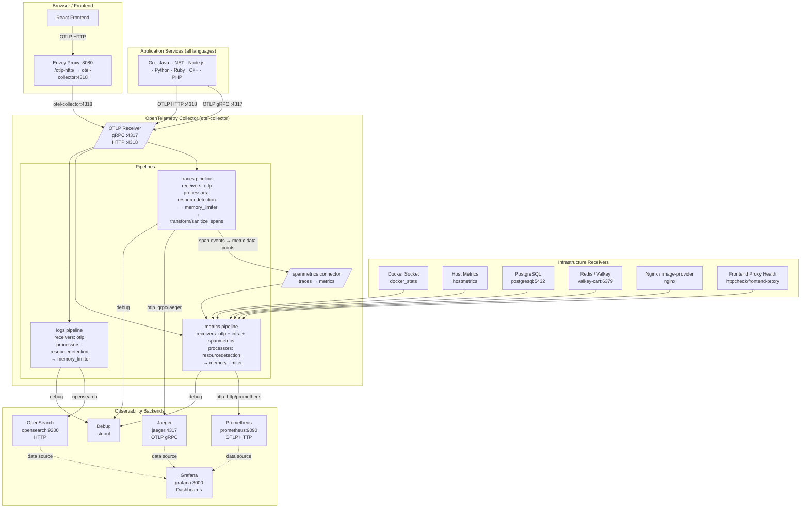

# OpenTelemetry Demo – Application OTEL Setup Guide

> **Scope:** How applications in the OpenTelemetry Demo send telemetry to the OpenTelemetry Collector gateway.
>
> Source file: `src/otel-collector/otelcol-config.yml`  
> Repo commit: `575de6d775e1e57df401d4bf6f954486918f087d`

---

## 1. OTEL Architecture

### 1.1 High-Level Architecture Diagram



### 1.2 Component Roles

| Component | Docker Service | Role |
|---|---|---|
| **OpenTelemetry Collector** | `otelcol` | Central telemetry pipeline. Receives OTLP from all app services; pulls infra metrics; fans out to Jaeger, Prometheus, OpenSearch. |
| **Jaeger** | `jaeger` | Distributed trace storage and UI (`jaeger:4317` ← traces via OTLP gRPC). |
| **Prometheus** | `prometheus` | Time-series metrics DB. Receives metrics via OTLP HTTP push (`prometheus:9090/api/v1/otlp`). |
| **OpenSearch** | `opensearch` | Log storage and search engine (`opensearch:9200`). Index: `otel-logs`. |
| **Grafana** | `grafana` | Unified observability dashboards. Queries Jaeger, Prometheus, OpenSearch as data sources. |
| **Frontend Proxy** | `frontendproxy` | Envoy on `:8080`. Routes browser OTLP/HTTP (`/otlp-http/`) to the collector. |
| **Image Provider** | `imageprovider` | nginx serving product images. Collector scrapes nginx `/status` for metrics. |
| **FlagD** | `flagd` | Feature-flag service for fault injection scenarios. |

### 1.3 Collector Pipeline Detail

Source: `src/otel-collector/otelcol-config.yml`

#### Receivers

| Receiver | Type | Target |
|---|---|---|
| `otlp` (gRPC) | Application telemetry | `${OTEL_COLLECTOR_HOST}:${OTEL_COLLECTOR_PORT_GRPC}` |
| `otlp` (HTTP) | Application telemetry | `${OTEL_COLLECTOR_HOST}:${OTEL_COLLECTOR_PORT_HTTP}` (CORS: `http://*`, `https://*`) |
| `httpcheck/frontend-proxy` | Synthetic health check | `http://${FRONTEND_PROXY_ADDR}` |
| `nginx` | Nginx stub status metrics | `http://${IMAGE_PROVIDER_HOST}:${IMAGE_PROVIDER_PORT}/status` (10 s interval) |
| `docker_stats` | Container CPU/mem/net metrics | `unix:///var/run/docker.sock` |
| `postgresql` | DB performance metrics | `${POSTGRES_HOST}:${POSTGRES_PORT}` (blks, tuples, deadlocks) |
| `redis` | Cache metrics | `valkey-cart:6379` (10 s interval) |
| `hostmetrics` | OS-level metrics | `/hostfs` (cpu, disk, load, filesystem, memory, network, paging, processes) |

#### Processors

| Processor | Config | Purpose |
|---|---|---|
| `resourcedetection` | detectors: `[env, docker, system]` | Enriches every span/metric/log with host, container, and env-var resource attributes. |
| `memory_limiter` | limit 80%, spike 25%, check 5 s | Drops telemetry when collector memory is near OOM. |
| `transform/sanitize_spans` | OTTL rules on spans | Fills missing `http.route` for key frontend paths; normalises span names to prevent high-cardinality span metrics. |

#### Connectors

| Connector | Purpose |
|---|---|
| `spanmetrics` | Reads from the **traces** pipeline; generates `calls` and `duration` metrics per span; feeds the **metrics** pipeline. |

#### Exporters

| Exporter | Signal | Destination | Details |
|---|---|---|---|
| `otlp_grpc/jaeger` | Traces | `jaeger:4317` | OTLP gRPC, TLS insecure, batched queue |
| `otlp_http/prometheus` | Metrics | `http://prometheus:9090/api/v1/otlp` | OTLP HTTP, TLS insecure, batched queue |
| `opensearch` | Logs | `http://opensearch:9200` | Index `otel-logs`, daily rotation (`yyyy-MM-dd`), queue 1000 |
| `debug` | All | stdout | Lightweight debug output |

#### Pipelines (service section)

```
traces:
  receivers  → [otlp]
  processors → [resourcedetection, memory_limiter, transform/sanitize_spans]
  exporters  → [otlp_grpc/jaeger, debug, spanmetrics]

metrics:
  receivers  → [docker_stats, httpcheck/frontend-proxy, hostmetrics, nginx,
                otlp, postgresql, redis, spanmetrics]
  processors → [resourcedetection, memory_limiter]
  exporters  → [otlp_http/prometheus, debug]

logs:
  receivers  → [otlp]
  processors → [resourcedetection, memory_limiter]
  exporters  → [opensearch, debug]
```

#### Collector Self-telemetry

The collector sends its **own** metrics and logs back to itself via OTLP HTTP:
```
endpoint: http://${OTEL_COLLECTOR_HOST}:${OTEL_COLLECTOR_PORT_HTTP}
protocol: http/protobuf
```

#### Extras Override

`src/otel-collector/otelcol-config-extras.yml` merges into the base config at startup. Operators can add receivers, processors, exporters, or connectors here without modifying the base file.

---

## 2. Connectivity Information

### 2.1 Environment Variables (from `.env`)

| Variable | Default Value | Description |
|---|---|---|
| `OTEL_COLLECTOR_HOST` | `otel-collector` | Docker service name of the collector |
| `OTEL_COLLECTOR_PORT_GRPC` | `4317` | OTLP gRPC listen port |
| `OTEL_COLLECTOR_PORT_HTTP` | `4318` | OTLP HTTP listen port |
| `FRONTEND_PROXY_ADDR` | `frontend-proxy:8080` | Health-check target for the frontend proxy |
| `IMAGE_PROVIDER_HOST` | `image-provider` | Nginx image provider host |
| `IMAGE_PROVIDER_PORT` | `8081` | Nginx image provider port |
| `POSTGRES_HOST` | `postgresql` | PostgreSQL host |
| `POSTGRES_PORT` | `5432` | PostgreSQL port |

### 2.2 Collector Endpoints

| Protocol | Internal URL | External URL | Use Case |
|---|---|---|---|
| OTLP gRPC | `http://otel-collector:4317` | Not directly exposed | Backend services — Go, Java, .NET, Python, Ruby, C++ |
| OTLP HTTP | `http://otel-collector:4318` | `http://localhost:8080/otlp-http/` | Browser JS apps; HTTP-only runtimes (PHP, Ruby) |

> **Browser path:** Envoy (`frontend-proxy:8080`) receives OTLP HTTP at `/otlp-http/`, strips the prefix, and forwards to `otel-collector:4318`. CORS is open (`http://*`, `https://*`).

### 2.3 Observability Backend Endpoints

| Backend | Internal | External (via Envoy) | Default Credentials |
|---|---|---|---|
| Jaeger UI | `http://jaeger:16686` | `http://localhost:8080/jaeger/ui/` | None |
| Prometheus | `http://prometheus:9090` | `http://localhost:8080/prometheus/` | None |
| Grafana | `http://grafana:3000` | `http://localhost:8080/grafana/` | admin / admin |
| OpenSearch | `http://opensearch:9200` | Not exposed | None (dev mode) |
| OpenSearch Dashboards | `http://opensearch-dashboards:5601` | `http://localhost:8080/opensearch-dashboards/` | None |

### 2.4 Network Topology

All services share a single Docker bridge network. Service names resolve via Docker DNS.

For **Kubernetes** (`kubernetes/opentelemetry-demo.yaml`):
- Collector `ClusterIP` service: `opentelemetry-demo-otelcol`
- Same ports apply (gRPC 4317, HTTP 4318)
- External access via Ingress / LoadBalancer

---

## 3. Requirements for Connection

### 3.1 OpenTelemetry SDK

Applications must include the OpenTelemetry SDK for their language:

| Language | SDK / Package |
|---|---|
| Go | `go.opentelemetry.io/otel` |
| Java | `io.opentelemetry:opentelemetry-sdk` |
| .NET (C#) | `OpenTelemetry` NuGet |
| JavaScript / Node.js | `@opentelemetry/sdk-node` |
| Python | `opentelemetry-sdk` |
| Ruby | `opentelemetry-sdk` gem |
| C++ | `opentelemetry-cpp` |
| PHP | `open-telemetry/sdk` |

### 3.2 Mandatory Environment Variables

```bash
# ── Exporter endpoint ────────────────────────────────────────────────────────
# gRPC (recommended for server-side services)
OTEL_EXPORTER_OTLP_ENDPOINT=http://otel-collector:4317

# HTTP (browser/HTTP-only runtimes)
OTEL_EXPORTER_OTLP_ENDPOINT=http://otel-collector:4318
OTEL_EXPORTER_OTLP_PROTOCOL=http/protobuf

# ── Service identity ─────────────────────────────────────────────────────────
OTEL_SERVICE_NAME=<your-service-name>

# ── Context propagation ──────────────────────────────────────────────────────
OTEL_PROPAGATORS=tracecontext,baggage

# ── Resource attributes ──────────────────────────────────────────────────────
OTEL_RESOURCE_ATTRIBUTES=service.name=$(OTEL_SERVICE_NAME),service.version=<version>
```

### 3.3 Per-Signal Endpoint Overrides (optional)

```bash
OTEL_EXPORTER_OTLP_TRACES_ENDPOINT=http://otel-collector:4317
OTEL_EXPORTER_OTLP_METRICS_ENDPOINT=http://otel-collector:4317
OTEL_EXPORTER_OTLP_LOGS_ENDPOINT=http://otel-collector:4317
```

### 3.4 Transport Security

The demo uses **no TLS** on internal Docker links. All collector exporters set `tls.insecure: true`.

```bash
# Explicitly disable TLS if your SDK requires it
OTEL_EXPORTER_OTLP_INSECURE=true
```

For production:
```bash
OTEL_EXPORTER_OTLP_ENDPOINT=https://otelcol:4317
OTEL_EXPORTER_OTLP_CERTIFICATE=/path/to/ca.crt
```

### 3.5 SDK Initialisation

| Language | Mechanism |
|---|---|
| Java | `-javaagent:opentelemetry-javaagent.jar` |
| .NET | `OTEL_DOTNET_AUTO_*` + auto-instrumentation NuGet |
| Node.js | `--require @opentelemetry/auto-instrumentations-node/register` |
| Python | `opentelemetry-instrument <your-app>` |
| Go | Manual `TracerProvider` / `MeterProvider` init in `main()` |
| Ruby | `OpenTelemetry::SDK.configure` block at boot |

### 3.6 What to Instrument

| Signal | What to capture |
|---|---|
| **Traces** | HTTP requests, gRPC calls, DB queries, message publish/consume |
| **Metrics** | Request rates, error rates, latency histograms, custom business metrics |
| **Logs** | Structured logs with `trace_id` / `span_id` injected for correlation |

### 3.7 Span Name Quality (Important)

The collector's `transform/sanitize_spans` processor normalises span names to prevent **cardinality explosion** in the `spanmetrics` connector. If your service generates high-cardinality span names (e.g. `/api/products/1YMWWN1N4O`), you must either:

1. Set `http.route` attribute on server spans (e.g. `/api/products/{productId}`), **or**
2. Add OTTL rules to `otelcol-config-extras.yml` to normalise your service's span names.

### 3.8 Collector Authentication (if needed)

The base config has no auth. To add bearer token auth via `otelcol-config-extras.yml`:

```yaml
extensions:
  bearertokenauth:
    token: "<your-token>"

receivers:
  otlp:
    protocols:
      grpc:
        auth:
          authenticator: bearertokenauth
```

Application side:
```bash
OTEL_EXPORTER_OTLP_HEADERS=Authorization=Bearer <your-token>
```

---

## 4. Quick-Start Checklist

```
[ ] 1. Add the OTel SDK dependency for your language
[ ] 2. Set OTEL_SERVICE_NAME=<your-service-name>
[ ] 3. Set OTEL_EXPORTER_OTLP_ENDPOINT:
         gRPC → http://otel-collector:4317
         HTTP → http://otel-collector:4318  +  OTEL_EXPORTER_OTLP_PROTOCOL=http/protobuf
[ ] 4. Set OTEL_PROPAGATORS=tracecontext,baggage
[ ] 5. Initialise the SDK at application startup
[ ] 6. Ensure your container is on the same Docker network as otelcol
[ ] 7. Set http.route on server spans (avoids span-metrics cardinality explosion)
[ ] 8. Verify traces in Jaeger:     http://localhost:8080/jaeger/ui/
[ ] 9. Verify metrics in Prometheus: http://localhost:8080/prometheus/
[ ]10. Verify logs in Grafana:       http://localhost:8080/grafana/
```

---

## 5. References

| Resource | Path |
|---|---|
| Collector base config | `src/otel-collector/otelcol-config.yml` |
| Collector extras override | `src/otel-collector/otelcol-config-extras.yml` |
| Environment defaults | `.env` |
| Docker Compose | `docker-compose.yml` |
| Kubernetes manifest | `kubernetes/opentelemetry-demo.yaml` |
| Envoy proxy config | `src/frontend-proxy/envoy.tmpl.yaml` |
| [OTel Collector docs](https://opentelemetry.io/docs/collector/) | — |
| [OTLP spec](https://opentelemetry.io/docs/specs/otlp/) | — |