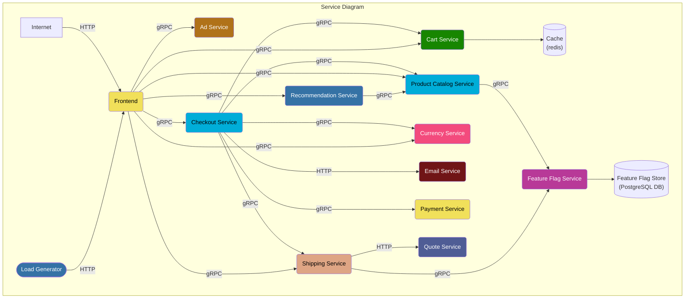
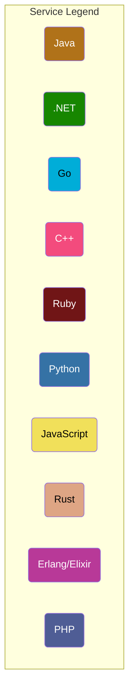

# Demo Architecture

**Online Boutique** is composed of microservices written in different programming
languages that talk to each other over gRPC and HTTP; and a load generator which
uses [Locust](https://locust.io/) to fake user traffic.

Find the **Protocol Buffer Definitions** in the `/pb/` directory.
