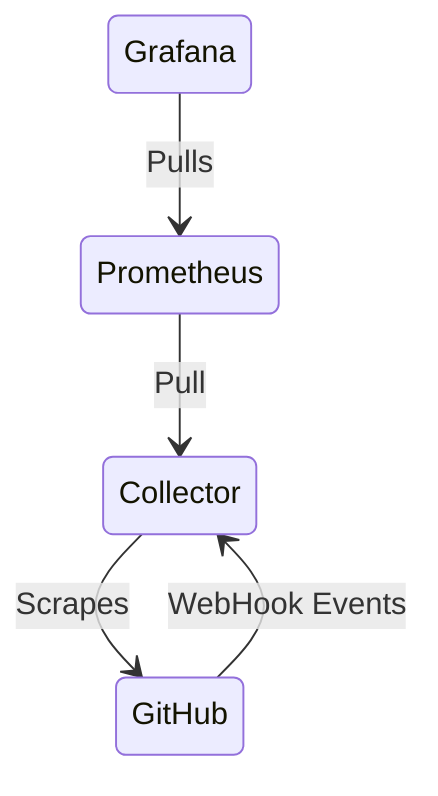
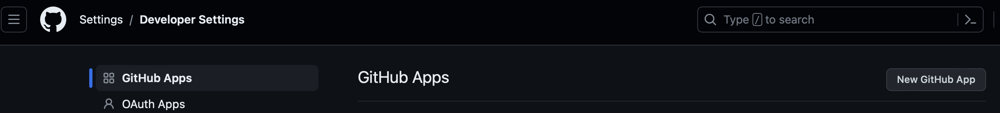
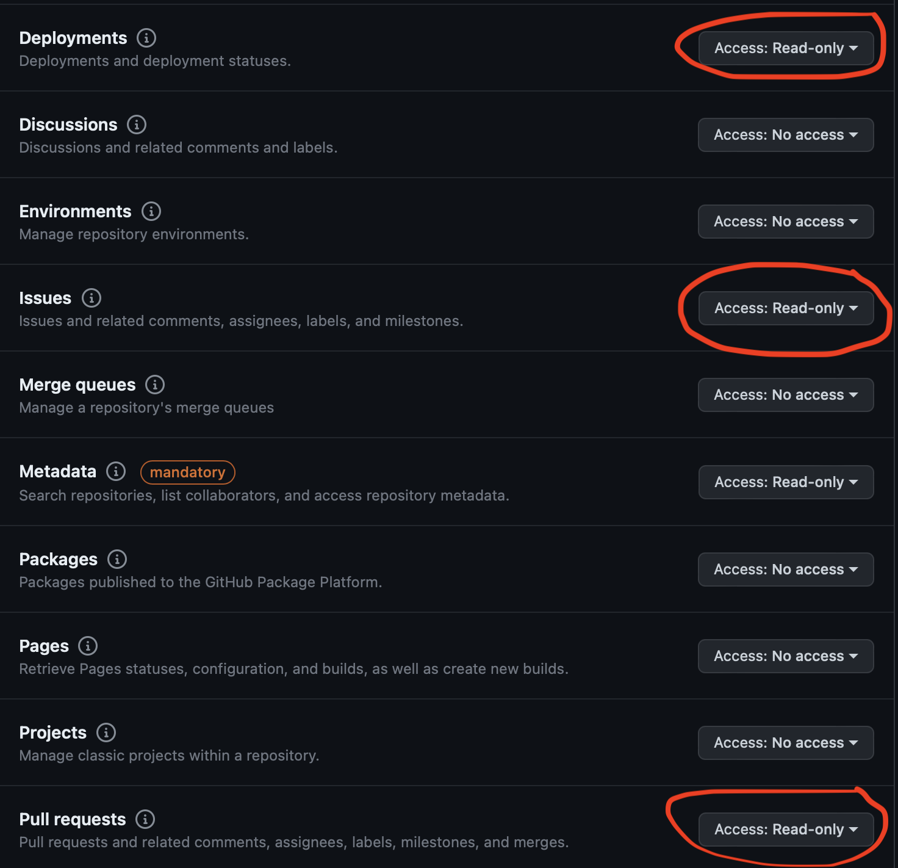
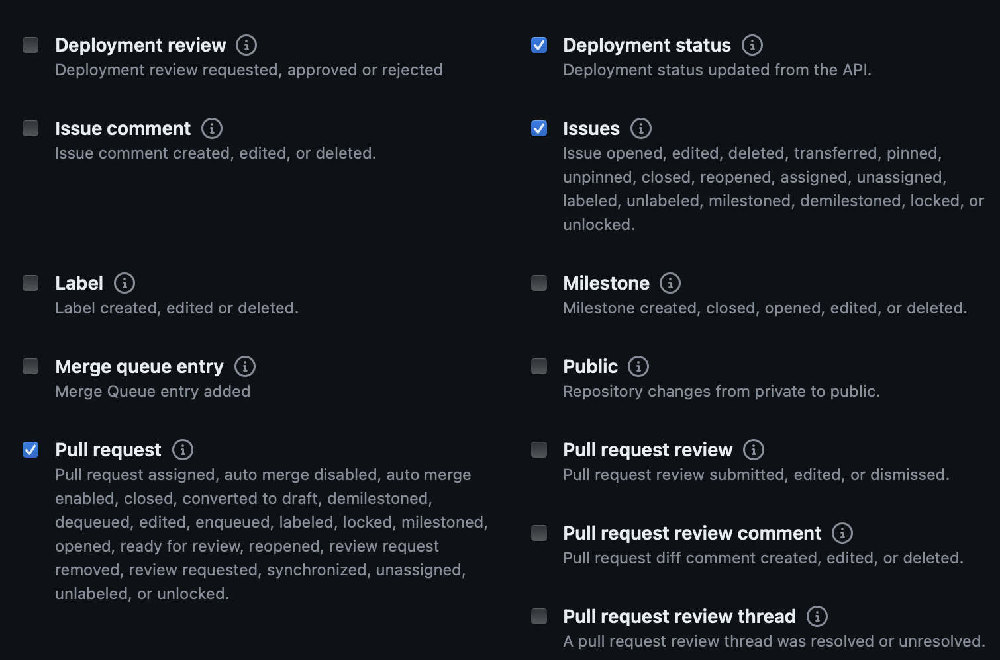

# Delivery Demo

> IMPORTANT: At this time, this fork only supports the Docker Setup.

This bonus section showcases delivery focused metrics by leveraging the Astronomy
shop. There are two sets of delivery metrics available through this fork:

1. Leading indicators (GitHub Metrics)
2. Lagging indicators (DORA from GitHub)

Both sets of metrics are meant to be leveraged together, yet on their own, still
provide engineers with valuable data. These metrics capture point-in-time data and
are meant to be looked at overtime to determine trends of improvement.

There is some setup required in order to get these metrics working. You will need:

- A personal access token with access to GitHub
- A repository setup to emit event logs from GitHub through a webhook based GitHub
app
- Some mechanism to forward webhook calls to your local machine, like ngrok

We'll detail how to setup these things up exactly in a later section.

## Table of Contents

- [Delivery Demo](#delivery-demo)
    - [Architecture](#architecture)
    - [Pre-requisites](#pre-requisites)
        - [PAT for GitHub Metrics](#personal-access-token-for-github-metrics)
        - [GitHub App Setup](#github-app-setup-for-webhook-events)
    - [Local Docker Setup](#local-docker-setup)
        - [Leading Indicators](#leading-delivery-indicators-github)
        - [Lagging Indicators (DORA)](#lagging-delivery-indicators-dora)

## Architecture

The `delivery metrics` demo expands on the existing OpenTelemetry demo by using the
[Liatrio distribution of OpenTelemetry](https://github.com/liatrio/liatrio-otel-collector)
collector to gather metrics from GitHub through the [Git Provider
Receiver](https://github.com/liatrio/liatrio-otel-collector/tree/main/receiver/gitproviderreceiver)
and the [WebHook Event Receiver](https://github.com/open-telemetry/opentelemetry-collector-contrib/tree/main/receiver/webhookeventreceiver).
This gathered event logs are used populate a DORA metrics dashboard in Grafana.



## Pre-requisites

### Personal Access Token for GitHub Metrics

- The Liatrio OpenTelemetry Collector images are hosted on ghcr.io see [here](https://docs.github.com/en/packages/working-with-a-github-packages-registry/working-with-the-container-registry#authenticating-with-a-personal-access-token-classic) for instructions on how to login
- The runtime Collector requires a GitHub Personal Access Token with the following configurations (Can be fine-grained or classic):
  - repo:All
  - read:packages
  - read:org
  - read:user
  - read:enterprise
  - read:project


### GitHub App Setup for WebHook Events

1. Create a GitHub App with permissions for `Issues` `Deployments` and
`Pull requests` then have it subscribed to `Issues` `Deployment Status` and
`Pull request` events while leaving webhooks disabled for now. This can be done
by navigating to Settings->Developer Settings->GitHub Apps.



GitHub App Permissions             |  Github App Event Subscriptions
:-------------------------:|:-------------------------:
  |   

3. Using [Ngrok](https://ngrok.com) or another tool to forward traffic from your
GitHub App to your local machine, set up forwarding to `http://localhost:8088/`
which is going to be the endpoint for our webhook receiver should it be running
locally.
4. This is going to give you a web address which we will be using as our webhook
url in our GitHub App.  Be sure to add `/events` to that address as that is the
path that the webhook event receiver will be expecting these event logs at by default.

#### Requirements
1. Use GitHub Issues to track outages/interuptions in service caused by a recent
deployment
2. There should only be one issue open at a time with a label called `incident`
for all problems caused by the latest deployment
3. For GitHub to keep track of your deployments, you must be using GitHub Environments
inside the workflow that runs the deployment
4. The workflow also has to be using tooling that deploys your code from GitHub
to an external platform or GitHub itself such as [Terraform](https://www.terraform.io)

## Local Docker Setup

Due to all the pre-requisites for setting up DORA metrics, this portion of the demo
separates the Leading Indicators portion from the Lagging Indicators portion.

### Leading Delivery Indicators (GitHub)

This portion of the demo runs the Liatrio OTEL Collector with the Git
Provider Receiver to pull the leading indicators from a set of GitHub repositories.

1. Clone this repository and navigate to the root
2. Create a `.liatrio-otelcol.env` with the following content:
```
GH_PAT=<github token>
GH_ORG=<github org name>
GH_SEARCH_QUERY="org:${GH_ORG} <any search parameters https://docs.github.com/en/search-github/searching-on-github>"
```
3. Run `make start-delivery`

### Lagging Delivery Indicators (DORA)

This portion is much more intensive. 

1. Ensure you ran through the [GitHub App Setup](#github-app-setup-for-webhook-events)
2. Run `make start-dora`
