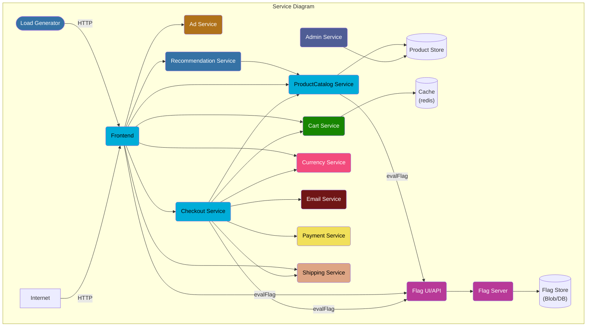
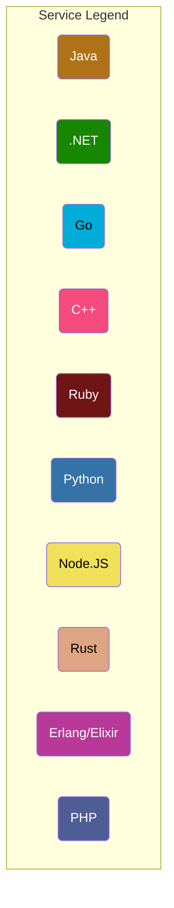

# Desired Service Map

This diagram illustrates the desired relationships between services for the v1 work.

```mermaid
graph TD

subgraph Service Diagram
adservice(Ad Service):::java
cache[(Cache<br/>&#40redis&#41)]
cartservice(Cart Service):::dotnet
checkoutservice(Checkout Service):::golang
currencyservice(Currency Service):::cpp
emailservice(Email Service):::ruby
frontend(Frontend):::golang
loadgenerator([Load Generator]):::python
paymentservice(Payment Service):::nodejs
productcatalogservice(ProductCatalog Service):::golang
recommendationservice(Recommendation Service):::python
shippingservice(Shipping Service):::rust
adminservice(Admin Service):::php
productstore[(Product Store)]:::db

Internet -->|HTTP| frontend
loadgenerator -->|HTTP| frontend
adminservice --> productstore

checkoutservice --> cartservice --> cache
checkoutservice --> productcatalogservice
checkoutservice --> currencyservice
checkoutservice --> emailservice
checkoutservice --> paymentservice
checkoutservice --> shippingservice
checkoutservice --> |evalFlag| featureflagfeservice

frontend --> adservice
frontend --> cartservice
frontend --> productcatalogservice
frontend --> checkoutservice
frontend --> currencyservice
frontend --> recommendationservice --> productcatalogservice
frontend --> shippingservice
frontend --> |evalFlag| featureflagfeservice

productcatalogservice --> |evalFlag| featureflagfeservice
productcatalogservice --> productstore

featureflagbeservice(Flag Server):::erlang
featureflagfeservice(Flag UI/API):::erlang
featureflagstore[(Flag Store<br/>&#40Blob/DB&#41)]

featureflagfeservice --> featureflagbeservice --> featureflagstore  

end
classDef java fill:#b07219,color:white;
classDef dotnet fill:#178600,color:white;
classDef golang fill:#00add8,color:black;
classDef cpp fill:#f34b7d,color:white;
classDef ruby fill:#701516,color:white;
classDef python fill:#3572A5,color:white;
classDef nodejs fill:#f1e05a,color:black;
classDef rust fill:#dea584,color:black;
classDef erlang fill:#b83998,color:white;
classDef php fill:#4f5d95,color:white;
```

```mermaid
graph TD
subgraph Service Legend
  javasvc(Java):::java
  dotnetsvc(.NET):::dotnet
  golangsvc(Go):::golang
  cppsvc(C++):::cpp
  rubysvc(Ruby):::ruby
  pythonsvc(Python):::python
  nodesvc(Node.JS):::nodejs
  rustsvc(Rust):::rust
  erlangsvc(Erlang/Elixir):::erlang
  phpsvc(PHP):::php
end

classDef java fill:#b07219,color:white;
classDef dotnet fill:#178600,color:white;
classDef golang fill:#00add8,color:black;
classDef cpp fill:#f34b7d,color:white;
classDef ruby fill:#701516,color:white;
classDef python fill:#3572A5,color:white;
classDef nodejs fill:#f1e05a,color:black;
classDef rust fill:#dea584,color:black;
classDef erlang fill:#b83998,color:white;
classDef php fill:#4f5d95,color:white;
```
