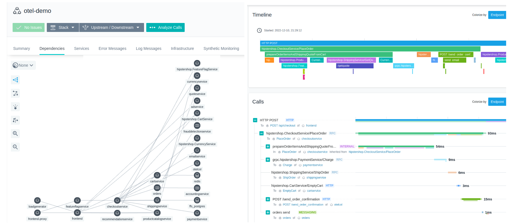

#  +  OpenTelemetry Demo with Instana

This repository contains a custom fork of the [OpenTelemetry Astronomy Shop](https://github.com/open-telemetry/opentelemetry-demo) integrated with an Instana backend. The demo showcases native Instana OpenTelemetry data collection, correlation of OpenTelemetry tracing and underlying monitored infrastructure, or example of trace continuity between Instana-native tracing and OpenTelemetry. Details about the implementation are sumamrized in the [OpenTelemetry Demo with Instana](https://community.ibm.com/community/user/instana/blogs/petr-styblo/2022/12/21/opentelementry-demo?CommunityKey=58f324a3-3104-41be-9510-5b7c413cc48f) blog article.

To learn more about the demo application please refer to the [upstream README](../README.md) and the [official demo documentation](https://opentelemetry.io/docs/demo/) available at the OpenTelemetry project site.

Custom features include:

- instrumented demo services to enable Instana infrastructure monitoring
- disabled Instana-native tracing in agent and services configuration
- include ready-to-use agent configuration and docker-compose deployment files (in [instana/agent](../instana/agent) folder)
- provide custom Helm [configuration file](../instana/values-instana-agent.yaml) to deploy the demo in Kubernetes (excluding Instana agent deployment)
- ship pre-built custom demo container images
- replaced OpenTelemetry tracer with Instana tracer on the Envoy Frontend-Proxy service to demonstrate Instana cross-protocol trace continuity support and W3C context propagation
- provisioned Frontend service with EUM JavaScript including code modifications to enable correlation between browser requests and the application backend.
- [amended OpenTelemetry Ecto library](../instana/customizations.md) to support span attributes for correct downstream linking with Postgres database

## Running the demo

Instructions on how to run the demo are provided [here](../instana/deploy-build.md).

## Reporting issues

If you found a bug, have a suggestion or a question regarding the Instana-specific functionality, please open an issue [here](https://github.com/instana/opentelemetry-demo/issues). Problems related to the core demo application should generally be reported via the [upstream OTel Demo project](https://github.com/open-telemetry/opentelemetry-demo/issues). Please read the [troubleshooting tips](../instana/troubleshooting.md) before you and issue.

## Contributing
Contributions are welcome - feel free to submit a pull request. You may find useful the upstream [CONTRIBUTING](https://github.com/instana/opentelemetry-demo/blob/main/CONTRIBUTING.md) for general general guidance on setting up a development environment or submitting GitHub PRs.
