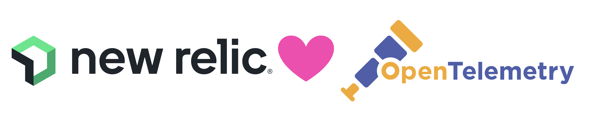
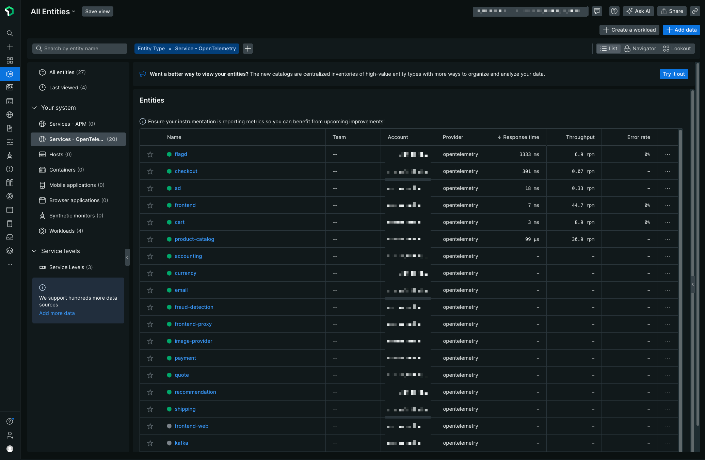
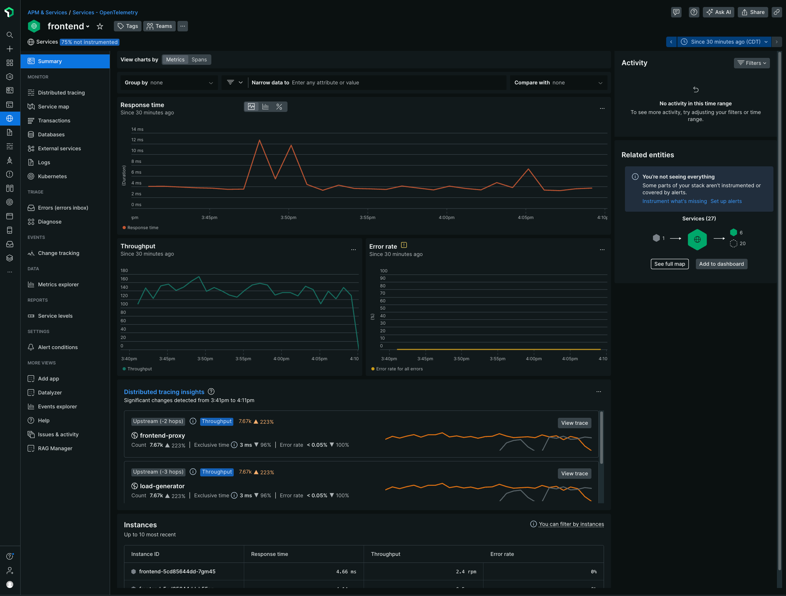
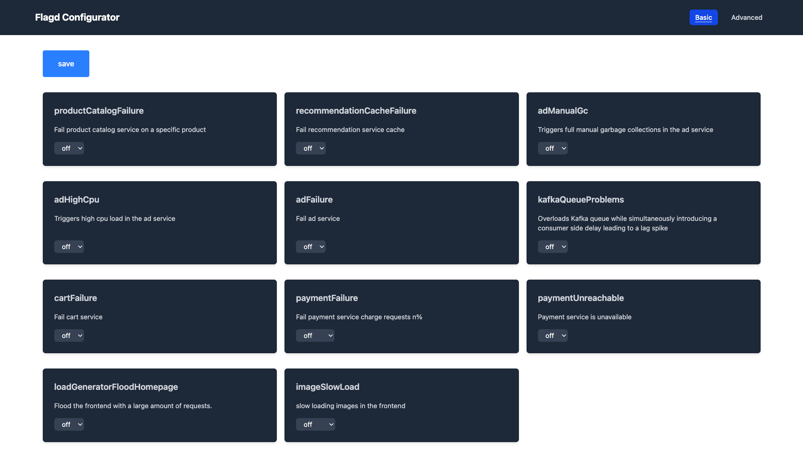

# OpenTelemetry Astronomy Shop Demo with New Relic



This repository contains a fork of the OpenTelemetry Astronomy Shop, a microservice-based distributed system intended to illustrate the implementation of OpenTelemetry in a near real-world environment.  It includes customizations for use with the New Relic platform.

## Table of Contents

- [Prerequisites](#prerequisites)
- [Setup](#setup)
- [Installation Options](#installation-options)
- [Kubernetes Installation](#kubernetes-installation)
- [Docker Installation](#docker-installation)
- [Validating the Install](#validating-the-install)
- [Accessing the Flagd UI](#accessing-the-flagd-ui)

## Prerequisites

You'll need a New Relic License Key from your New Relic account.  If you don't have an account, you can get one for [free!](https://newrelic.com/signup)

### Kubernetes

For our testing, we used a [Minikube](https://minikube.sigs.k8s.io/docs/start/) cluster with 4 CPUs and 8GB Memory.  The official demo docs state:

- Kubernetes 1.24+
- 6 GB of free RAM for the application
- Helm 3.14+ (for Helm installation method only)

For more details, see the Kubernetes Deployment docs [here](https://opentelemetry.io/docs/demo/kubernetes-deployment/).

### Docker

For our testing, we used [Docker Desktop](https://www.docker.com/products/docker-desktop/).  The official demo docs state:

- Docker
- [Docker Compose](https://docs.docker.com/compose/install/) v2.0.0+
- Make (option)
- 6 GB of RAM for the application

For more details, see the Docker Deployment docs [here](https://opentelemetry.io/docs/demo/docker-deployment/).

## Setup

Clone the repo.

```bash
git clone https://github.com/newrelic/opentelemetry-demo
```

Navigate to the `opentelemetry-demo/newrelic/scripts` directory on your machine:

```bash
cd opentelemetry-demo/newrelic/scripts
```

## Installation Options

- [Kubernetes](#kubernetes-installation)
- [Docker](./)

**Note**: both methods will require you to pint your New Relic Ingest License key. If you want to avoid inputting your key every time you run the script, you can also export a `NR_LICENSE_KEY` variable, which will take precedence if present.

## Kubernetes Installation

Run the `install-k8s.sh` script to install the Astronomy Shop Demo into your cluster.  This script uses `helm` to perform the install so if you'd rather use `kubectl` and manifests, you can find them [here](./k8s/rendered).  

> **_NOTE:_** You'll be prompted for your New Relic license key so have it ready!

```bash
./install-k8s.sh
```

Example output:

```bash
$ ./install-k8s.sh
Please enter your New Relic License Key: <REDACTED>
namespace/opentelemetry-demo created
secret/newrelic-license-key created
Release "otel-demo" does not exist. Installing it now.
NAME: otel-demo
LAST DEPLOYED: Fri Mar  7 16:17:51 2025
NAMESPACE: opentelemetry-demo
STATUS: deployed
REVISION: 1
TEST SUITE: None
NOTES:
=======================================================================================


 ██████╗ ████████╗███████╗██╗         ██████╗ ███████╗███╗   ███╗ ██████╗
██╔═══██╗╚══██╔══╝██╔════╝██║         ██╔══██╗██╔════╝████╗ ████║██╔═══██╗
██║   ██║   ██║   █████╗  ██║         ██║  ██║█████╗  ██╔████╔██║██║   ██║
██║   ██║   ██║   ██╔══╝  ██║         ██║  ██║██╔══╝  ██║╚██╔╝██║██║   ██║
╚██████╔╝   ██║   ███████╗███████╗    ██████╔╝███████╗██║ ╚═╝ ██║╚██████╔╝
 ╚═════╝    ╚═╝   ╚══════╝╚══════╝    ╚═════╝ ╚══════╝╚═╝     ╚═╝ ╚═════╝


- All services are available via the Frontend proxy: http://localhost:8080
  by running these commands:
     kubectl --namespace opentelemetry-demo port-forward svc/frontend-proxy 8080:8080

  The following services are available at these paths after the frontend-proxy service is exposed with port forwarding:
  Webstore             http://localhost:8080/
  Jaeger UI            http://localhost:8080/jaeger/ui/
  Grafana              http://localhost:8080/grafana/
  Load Generator UI    http://localhost:8080/loadgen/
  Feature Flags UI     http://localhost:8080/feature/
```

> **_NOTE:_** It can take anywhere from 2 - 5 minutes for Pods to start up and telemetry to flow through the OTel Collector and on to New Relic.  Please have patience.  If you want to check on the status of the OTel collector, you can run `kubectl logs deployment/otel-collector -n opentelemetry-demo`

### Customize Kubernetes installation
You can apply changes to the deployed OpenTelemetry Demo by modifying any values in `newrelic/k8s/helm/opentelemetry-demo.yaml`. See supported values in the official OpenTelemetry Demo Helm Chart [here](https://github.com/open-telemetry/opentelemetry-helm-charts/tree/main/charts/opentelemetry-demo#chart-parameters).

After you save changes, you can re-run `install-k8s.sh` to apply changes and redeploy the modified components.

### Cleanup Kubernetes

To uninstall the demo from your cluster, you can use the `cleanup-k8s.sh` script.  This script will uninstall the helm release and delete the `opentelemetry-demo` namespace.

```bash
./cleanup-k8s.sh
```

Example output:

```bash
$ ./cleanup-k8s.sh
Helm release 'otel-demo' found. Uninstalling...
release "otel-demo" uninstalled
Successfully uninstalled 'otel-demo'
Namespace 'opentelemetry-demo' found. Deleting...
namespace "opentelemetry-demo" deleted
```

## Docker Installation

While we recommend running in Kubernetes, the OpenTelemetry Astronomy Shop demo can also run on a Docker machine as well.  Use the `install-docker.sh` script to get up and running quickly.

> **_NOTE:_** You'll be prompted for your New Relic license key so have it ready!

```bash
$ ./install-docker.sh
Please enter your New Relic License Key: <REDACTED>
[+] Running 21/21
 ✔ Container fraud-detection  Started      16.2s 
 ✔ Container accounting       Started      16.2s 
 ✔ Container flagd-ui         Started       7.0s 
 ✔ Container checkout         Started      16.2s 
 ✔ Container frontend         Started      16.3s 
 ✔ Container cart             Started       7.9s 
 ✔ Container image-provider   Started       7.3s 
 ✔ Container recommendation   Started       8.5s 
 ✔ Container ad               Started       7.8s 
 ✔ Container quote            Started       7.6s 
 ✔ Container load-generator   Started      16.4s 
 ✔ Container kafka            Healthy      16.0s 
 ✔ Container valkey-cart      Started       5.8s 
 ✔ Container payment          Started       8.0s 
 ✔ Container product-catalog  Started       7.8s 
 ✔ Container shipping         Started       7.5s 
 ✔ Container email            Started       7.3s 
 ✔ Container currency         Started       7.8s 
 ✔ Container otel-collector   Started       6.5s 
 ✔ Container flagd            Started       5.9s 
 ✔ Container frontend-proxy   Started      15.7s 
 ```

> **_NOTE:_** It can take anywhere from 2 - 5 minutes for data to flow through the OTel Collector and become visible in New Relic once the containers are running.  Please have patience.  If you want to check on the status of the OTel collector, you can run `docker logs -f $(docker ps | grep otel-collector | awk '{print $1}')`.  Use `CTRL + C` to exit.

### Cleanup Docker

To uninstall the demo from your machine, you can use the `cleanup-docker.sh` script.  This script will stop and then remove all of the created containers for the demo

```bash
./cleanup-docker.sh
```

Example Output - (Warnings can be ignored):

 ```bash
$ ./cleanup-docker.sh
WARN[0000] The "NEW_RELIC_LICENSE_KEY" variable is not set. Defaulting to a blank string. 
WARN[0000] The "NEW_RELIC_LICENSE_KEY" variable is not set. Defaulting to a blank string. 
[+] Running 22/22
 ✔ Container frontend-proxy    Removed      10.2s 
 ✔ Container fraud-detection   Removed      0.6s 
 ✔ Container accounting        Removed      0.2s 
 ✔ Container load-generator    Removed      5.4s 
 ✔ Container flagd-ui          Removed      0.2s 
 ✔ Container frontend          Removed      0.2s 
 ✔ Container checkout          Removed      0.2s 
 ✔ Container quote             Removed      0.3s 
 ✔ Container recommendation    Removed      10.2s 
 ✔ Container ad                Removed      0.6s 
 ✔ Container image-provider    Removed      0.2s 
 ✔ Container shipping          Removed      10.2s 
 ✔ Container cart              Removed      0.3s 
 ✔ Container kafka             Removed      1.3s 
 ✔ Container email             Removed      0.2s 
 ✔ Container payment           Removed      0.8s 
 ✔ Container currency          Removed      10.2s 
 ✔ Container valkey-cart       Removed      0.2s 
 ✔ Container product-catalog   Removed      0.1s 
 ✔ Container flagd             Removed      0.2s 
 ✔ Container otel-collector    Removed      1.5s 
 ✔ Network opentelemetry-demo  Removed      0.0s
 ```

### Known Issues with Docker

You may see errors in the OTel Collector logs related to the `dockerstats` receiver.  It appears that this is related to running the demo on a Mac.  More info [here.](https://github.com/open-telemetry/opentelemetry-demo/issues/1677)

## Validating the Install

Check the container logs for the OTel Collector to ensure there aren't any errors related to data collection or shipping telemetry to the New Relic platform. After a few minutes, you should see a list of the Astronomy Shop services in the `Services - OpenTelemetry` menu under the `All Entities` view.  



If you click on the `Frontend` service, you should see data populated in the Summary page.



## Accessing the FlagD UI

You can enable / disable various feature flags provided by the community using the Flagd UI.  In order to access the Flagd UI, you'll need to set up port-forwarding to your local machine.  Here's an example command you can use:

```bash
kubectl -n opentelemetry-demo port-forward svc/frontend-proxy 8080:8080
```

If port `8080` is already in use on your local machine, use a different port like `9999` or another that you know will be open.  For example:

```bash
kubectl -n opentelemetry-demo port-forward svc/frontend-proxy 9999:8080
```

After setting up port forwarding, you can access the Flagd UI at [http://localhost:4000/feature](http://localhost:4000/feature).


