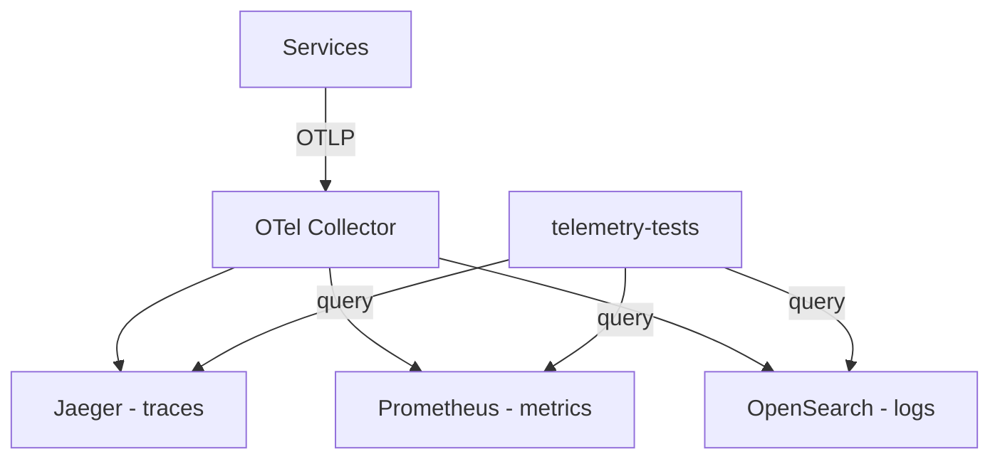

<!-- Copyright The OpenTelemetry Authors -->
<!-- SPDX-License-Identifier: Apache-2.0 -->

# Telemetry Sanity Tests

## Problem

The demo previously used Tracetest for trace-based integration
testing, but that project went defunct and was removed. There is no
holistic replacement that validates telemetry is flowing across all
three pillars (traces, metrics, logs) to the observability backends.

## Goals

- Sanity-check that each service sends expected telemetry to the
  correct backends
- Run on every PR in CI
- Run locally via `make` (same as other demo workflows)
- OS-agnostic (Dockerized test runner)
- Easy to extend: adding a service = adding one line to a config dict
- Does NOT validate semantic conventions or attributes (weaver's job)

## Approach

Dockerized Python (pytest) container running on the same Docker
network as the demo. Queries backend APIs to verify services are
producing telemetry.

A session-scoped warmup fixture runs before the per-test checks. It
first drives a few real checkouts through the frontend proxy (the same
endpoints the load generator uses), then waits until Jaeger, Prometheus,
and OpenSearch have all ingested telemetry. The checkouts make
low-frequency services that only emit on the checkout path (e.g. `email`,
`quote`) produce telemetry deterministically instead of depending on the
load generator's task mix landing inside the test window. The probe is
best-effort and controlled by `WARMUP_PROBE_ENABLED` /
`WARMUP_PROBE_CHECKOUTS` (see Environment Variables).



## File Structure

```text
test/telemetry/
|-- Dockerfile
|-- requirements.txt
|-- conftest.py
|-- services.py
|-- test_collector.py
|-- test_traces.py
|-- test_traces_edges.py
|-- test_metrics.py
+-- test_logs.py
```

## Service-Signal Matrix

Single source of truth in `services.py`. Each service declares which
signals it emits:

| Service          | Traces | Metrics | Logs  | Scope   |
| ---------------- | ------ | ------- | ----- | ------- |
| ad               | yes    | yes     | yes   | minimal |
| cart             | yes    | yes     | yes   | minimal |
| checkout         | yes    | yes     | yes   | minimal |
| currency         | yes    | yes     | yes   | minimal |
| email            | yes    | yes     | yes   | minimal |
| frontend         | yes    | yes     | no    | minimal |
| frontend-proxy   | yes    | yes     | yes   | minimal |
| frontend-web     | yes    | yes     | no    | full    |
| image-provider   | yes    | yes     | no    | minimal |
| kafka            | no     | yes     | yes   | full    |
| payment          | yes    | yes     | yes   | minimal |
| product-catalog  | yes    | yes     | yes   | minimal |
| product-reviews  | yes    | yes     | yes   | full    |
| quote            | yes    | yes     | yes   | minimal |
| recommendation   | yes    | yes     | yes   | minimal |
| shipping         | yes    | yes     | yes   | minimal |
| accounting       | yes    | yes     | yes   | full    |
| fraud-detection  | yes    | yes     | yes   | full    |
| load-generator   | yes    | yes     | yes   | minimal |

## Backend API Queries

**Jaeger (traces):**

- List services: `GET /jaeger/ui/api/services`
- Find traces: `GET /jaeger/ui/api/traces?service={name}&limit=1`
- Verify directed inter-service edges: walk traces returned from
  `GET /jaeger/ui/api/traces?service={parent}&limit=20` and match
  parent spans to their direct children via `references[CHILD_OF]`
  (or `parentSpanID`) plus `processes[processID].serviceName`.
  We do not use `/api/dependencies` because Jaeger's in-memory
  backend rotates traces and the aggregator output is unreliable
  within the warmup window.

**Prometheus (metrics):**

- Check service presence:
  `GET /api/v1/query?query=target_info{service_name="{name}"}`

**OpenSearch (logs):**

- PPL query:
  `source=otel-logs-* | where resource.service.name = '{name}'
  | stats count()`

**OTel Collector (health):**

- TCP connect to `otel-collector:4317` (gRPC OTLP port)

## Makefile Targets

```bash
make run-telemetry-tests           # Full scope (all services)
make run-telemetry-tests-minimal   # Minimal scope
```

## Environment Variables

| Variable                 | Default      | Description                                     |
| ------------------------ | ------------ | ----------------------------------------------- |
| `JAEGER_HOST`            | `jaeger`     | Jaeger hostname                                 |
| `JAEGER_UI_PORT`         | `16686`      | Jaeger query port                               |
| `PROMETHEUS_HOST`        | `prometheus` | Prometheus hostname                             |
| `PROMETHEUS_PORT`        | `9090`       | Prometheus query port                           |
| `OPENSEARCH_HOST`        | `opensearch` | OpenSearch hostname                             |
| `OPENSEARCH_PORT`        | `9200`       | OpenSearch port                                 |
| `TEST_SCOPE`             | `minimal`    | `minimal` or `full`                             |
| `WARMUP_SECONDS`         | `240`        | Max seconds to wait for backends before testing |
| `POLL_TIMEOUT`           | `180`        | Per-test seconds to poll a backend for data     |
| `WARMUP_PROBE_ENABLED`   | `true`       | Drive checkouts during warmup (see Approach)    |
| `WARMUP_PROBE_CHECKOUTS` | `5`          | Number of checkouts the warmup probe drives     |

## CI Integration

Separate workflow (`.github/workflows/run-telemetry-tests.yml`)
with two parallel jobs: full and minimal. Triggered on PRs
touching `src/`, `test/telemetry/`, or compose files.

## Extending

- **New service**: Add one entry to `SIGNAL_MATRIX` in `services.py`
- **New service edge**: Add one tuple to `SERVICE_EDGES` in `services.py`
- **New backend**: Add a new `test_*.py` file
- **Adjust timeouts**: Set `WARMUP_SECONDS` or `POLL_TIMEOUT` env vars
- **Run single test**: `pytest test_traces.py -k "checkout" -v`
- **Run single edge**: `pytest test_traces_edges.py -k "frontend->cart" -v`

## Relationship to Weaver

Weaver validates the telemetry schema registry (correct attribute
names, types, semantic conventions). These tests validate that
telemetry flows end-to-end. They are complementary:

- **Weaver**: "Are the attribute definitions correct?" (static)
- **Telemetry tests**: "Is each service sending data?" (runtime)
