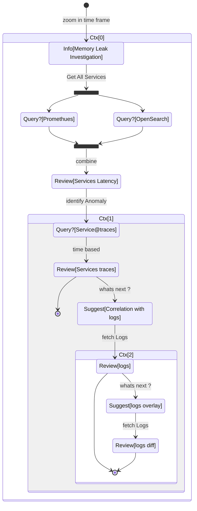

# Memory Leak Investigation Tutorial

## Tutorial Definition

The following tutorial describes Using Metrics and Traces to diagnose a memory leak
Application telemetry, such as the kind that OpenTelemetry can provide, is very useful for diagnosing issues in a
distributed system. In this scenario, we will walk through a scenario demonstrating how to move from high-level metrics
and traces to determine the cause of a memory leak.

## Diagnosis

The first step in diagnosing a problem is to determine that a problem exists. Often the first stop will be a metrics
dashboard provided by a tool such as metrics analytics under open search observability.

## Dashboards

This tutorial contains the OTEL demo dashboards with a number of charts:

- Recommendation Service (CPU% and Memory)
- Service Latency (from SpanMetrics)
- Error Rate

Recommendation Service charts are generated from OpenTelemetry Metrics exported to Prometheus, while the Service Latency
and Error Rate charts are generated through the OpenTelemetry Collector Span Metrics processor.

From our dashboard, we can see that there seems to be anomalous behavior in the recommendation service – spiky CPU
utilization, as well as long tail latency in our p95, 99, and 99.9 histograms. We can also see that there are
intermittent spikes in the memory utilization of this service.
We know that we’re emitting trace data from our application as well, so let’s think about another way that we’d be able
to determine that a problem exist.

### Traces exploration

OpenSearch Observability Trace analytics allows us to search for traces and display the end-to-end latency of an entire
request with visibility into each individual part of the overall request. Perhaps we noticed an increase in tail latency
on our frontend requests. Traces dashboard allows us to then search and filter our traces to include only those that
include requests to recommendation service.

By sorting by latency, we’re able to quickly find specific traces that took a long time. Clicking on a trace in the
right panel, we’re able to view the waterfall view.
We can see that the recommendation service is taking a long time to complete its work, and viewing the details allows us
to get a better idea of what’s going on.

### Confirming the Diagnosis

We can see in our waterfall view that the app.cache_hit attribute is set to false, and that the `app.products.count` value
is extremely high.

Returning to the search UI, filter to `recommendationservice` in the Service dropdown, and search for app.cache_hit=true
in the Tags box.

Notice that requests tend to be faster when the cache is hit. Now search for `app.cache_hit=false` and compare the
latency.

You should notice some changes in the visualization at the top of the trace list.

Now, since this is a contrived scenario, we know where to find the underlying bug in our code. However, in a real-world
scenario, we may need to perform further searching to find out what’s going on in our code, or the interactions between
services that cause it.

### SOP flow context aware

The next diagram shows the context aware phases within this SOP.

The user can be shown the summary of the flow for solving his issue and in addition can focus on the actual step he is
currently performing.

The overall process is mapped into a **state machine** in-which each step has a state with a **transition**.

When user goes into a different **scope** (`time based` ,`service based`, `log based`) this is defined as a indexed Context (`Ctx[1]`,`Ctx[2]`,...)

