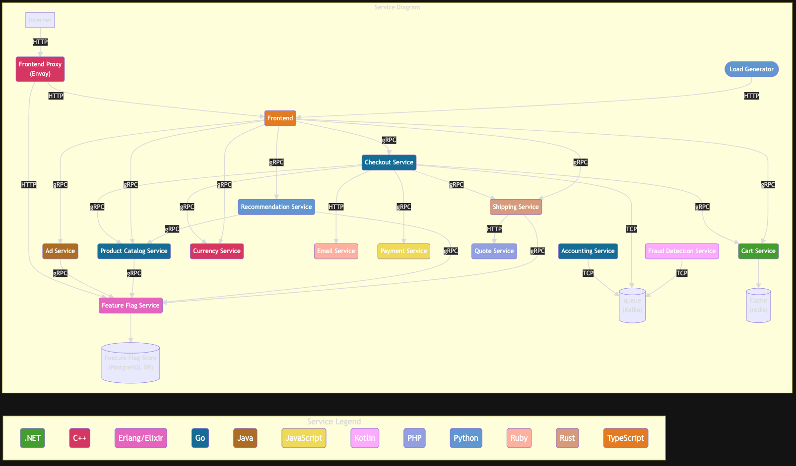
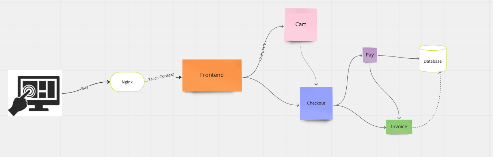

# OTEL Astronomy Demo Application

The following diagram presents the OTEL Astronomy shop services architecture:

### Trace Collectors
Gaining a macro-level perspective on incoming data, such as sample counts and cardinality, is essential for comprehending the collector’s internal dynamics. However, when delving into the details, the interconnections can become complex. The Collector Data Flow Dashboard aims to demonstrate the capabilities of the OpenTelemetry demo application, offering a solid foundation for users to build upon.

Monitoring data flow through the OpenTelemetry Collector is crucial for several reasons.
 - All services are traces in all the development languages
 - Auto instrumented
 - Manual spans and attributes
 - Span events
 - Span links

Trace Headers are propagated across all services (**Context propagation**)

### Metric Collectors
Collecting all the KPI information into Prometheus time series storage including:
 - runtime metrics
 - HTTP / gRPC latency distribution

### Data Flow Overview
Collector Data Flow Dashboard provides valuable guidance on which metrics to monitor. Users can tailor their own dashboard variations by adding necessary metrics specific to their use cases, such as memory_delimiter processor or other data flow indicators. This demo dashboard serves as a starting point, enabling users to explore diverse usage scenarios and adapt the tool to their unique monitoring needs.

The diagram below provides an overview of the system components, showcasing the configuration derived from the OpenTelemetry Collector (otelcol) configuration file utilized by the OpenTelemetry demo application. Additionally, it highlights the observability data (traces and metrics) flow within the system.

#### Simple purchase use case
This flow diagram shows the trace evolution from the user selecting a purchased item going through different backend services until reaching the storage database.

## Reference
**_OTEL Demo info_**
- [architecture](https://opentelemetry.io/docs/demo/architecture/)
- [collector-data-flow-dashboard](https://opentelemetry.io/docs/demo/collector-data-flow-dashboard/)
- [services](https://opentelemetry.io/docs/demo/services/)

**_OTEL Demo youtubes_**
 - [Cloud Native Live: OpenTelemetry community demo](https://www.youtube.com/watch?v=kD0EAjly9jc)
