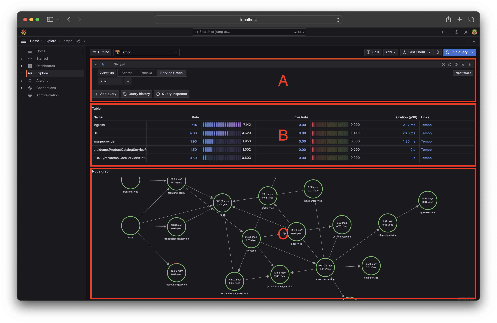
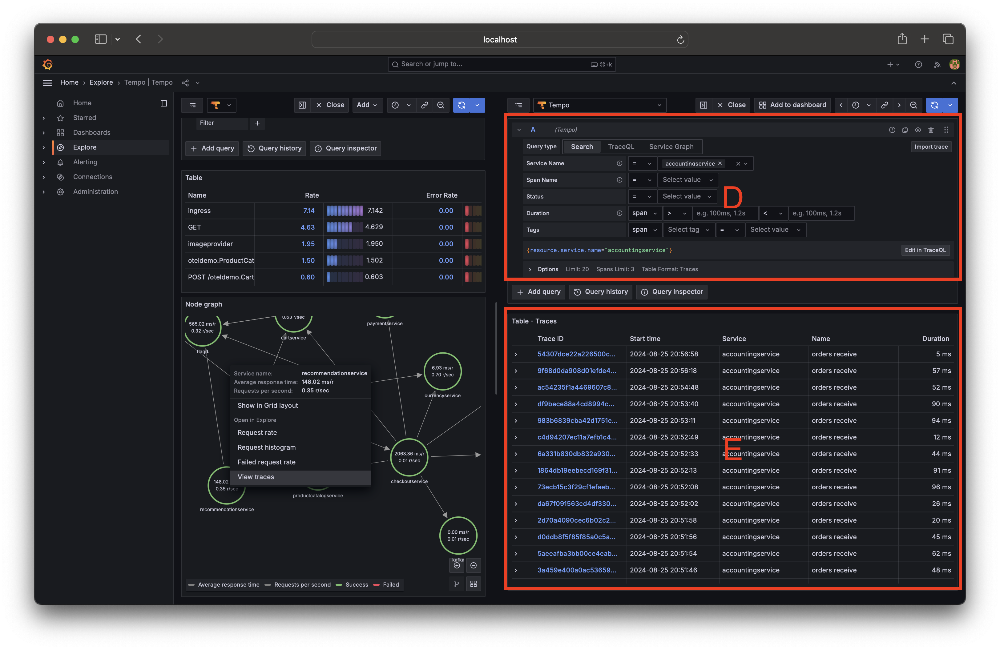
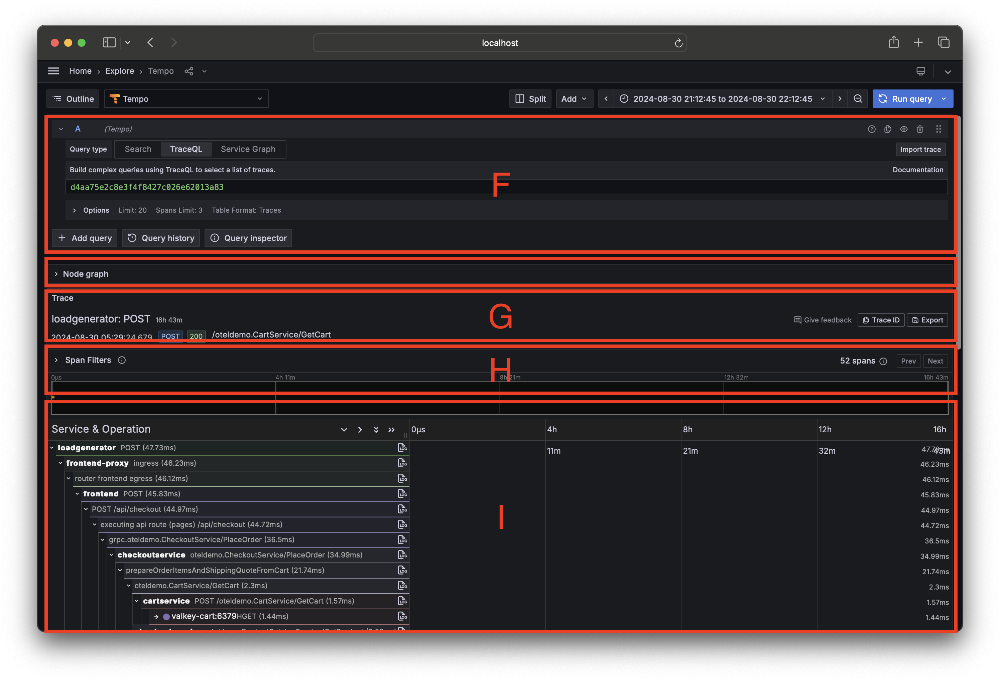

# Lab 4: Exploring data in Grafana

In this section, we will explore the OpenTelemetry data (logs, metrics, and traces) in Grafana. We will use the Grafana dashboard to visualize the data and understand the performance of the application.

## Prerequisites

Make sure you have started the stack using Docker Compose. If you haven't done that yet, please run the following command:

```bash
docker-compose up -d flagd
docker-compose up -d otel-lgtm
docker-compose up
```

## Access Grafana

Open your browser and navigate to [http://localhost:8080/grafana](http://localhost:8080/grafana). You will see the Grafana login page.

The default username and password are: `admin` and `admin`. Enter the credentials and click on the `Log in` button.

Navigate to the [`Explore`](http://localhost:8080/grafana/explore) section in the left sidebar to start exploring the data. You can use the `Prometheus`, `Loki`, and `Tempo` data sources to query for `metrics`, `logs`, and `traces`, respectively.

Let's jump righ in and start exploring the traces.

## Working with Traces

!!!
    Before you continue, we reccomend you watch the following video to get a better understanding of the Grafana Tempo query language (TraceQL).

    [](https://vimeo.com/796408188)

In the `Explore` section, select the `Tempo` data source and click on the `Service Graph` tab.



In this view, you have three sections labeled `A`, `B`, and `C`.

- Section `A` is your query editor. You can write a query to filter the traces based on the service name, operation name, and other attributes.
- Section `B` is the latency and error rate for the 5 most seen operations.
- Section `C` is the service graph. It shows the relationship between the services and the operations.

When you hover over a node in the service graph, you will see the request rate for the service and the request rate for all the edges connected to the service.

You can click on the nodes in the service graph to see the traces for that service. You can also click on the operations in the latency and error rate section to see the traces for that operation.

!!! info

    :question: How many services are there in the service graph?

    :question: Using the `Service Graph`, what services are the the `checkoutservice` connected to and what are the relationships to them?

    <details>
    <summary>Hint</summary>

    The `checkoutservice` is connected to following services:

    * `productcatalogservice` (outbound)
    * `currencyservice` (outbound)
    * `shippingservice` (outbound)
    * `emailservice` (outbound)
    * `kafka` (outbound)
    * `paymentservice` (outbound)
    * `cartserice` (outbound)
    * `frontend` (inbound)
    </details>

    :question: Can you spot the failing service(s) in the service graph? What is the error rate for the failing service?

    <details>
    <summary>Hint</summary>

    The `adservice` is failing. The error rate is around `0.01`. Click on the `adservice` node and select the `Failed request rate` menu to see the error rate.
    </details>

Let's see some more details about our traces. Click on the `frontend` node in the service graph to see the traces for the service by clicking on the `View traces` menu.



This will open the `Trace Search` view that has two sections labeled `D` and `E`.

- Section `D` is the trace search query editor. You can write a query to filter the traces based on the service name, operation name, and other attributes. You can see this section is pre-populated with the `frontend` service name. Just below the query editor, you can see the corresponding TraceQL query.
- Section `E` is the list of traces that match the query. You can click on a trace to see the details of the trace.

The table in section `E` shows the following columns:

- `Trace ID`: The unique identifier for the trace.
- `Start time`: The start time of the trace.
- `Service`: The initiating service name for the trace.
- `Name`: The initiating span name for the trace.
- `Duration`: The duration of the trace.

!!! info

    :question: Sort the list of traces by the `Duration` column. What is the longest duration of a trace? And what is the shortest duration of a trace?

Let's add some filters to our trace search query to refine the results and find the traces that we are interested in. This is the true power of tracing, the ability to filter and search for traces based on the attributes of the spans.

!!! info

    :question: Find the traces for the `frontend` service where the `http.method` is `POST`. What is the TraceQL query for this filter?

    <details>
    <summary>Hint</summary>
    Apply the following filter in the query editor:

    * `span`
    * `http.method`
    * `=`
    * `POST`

    The TraceQL query for this filter is:

    ```promql
    {span.http.method="POST" && resource.service.name="fronted"}
    ```
    </details>

    :question: Find the traces for the `frontend` service where the `http.method` is `GET` and `http.status_code` is `500`. What is the TraceQL query for this filter?

    <details>
    <summary>Hint</summary>
    Apply the following filter in the query editor:

    * `span`
    * `http.method`
    * `=`
    * `GET`

    Click the `+` button to add another filter:

    * `span`
    * `http.status_code`
    * `=`
    * `500`

    The TraceQL query for this filter is:

    ```promql
    {span.http.method="GET" && span.http.status_code="500" && resource.service.name="fronted"}
    ```
    </details>

As you can see, you can apply multiple filters to the query editor to refine the results and find the traces that you are interested in.

So far we have only queried a single span, but as you know a trace is a collection of spans and TraceQL allows you to query the relationships between spans. Let's see how we can do that.

To query the relationships between spans, we need to use the `TraceQL` query type. Each query is surrounded by curly braces `{}` and you can use the following operators:

* `>` : Direct parent-child relationship.
* `>>` : Ancestor-descendant relationship.

Here is an example of a query that finds the traces where the `frontend` service calls the `checkoutservice` service directly:

```promql
{span.service.name="frontend"} > {span.service.name="checkoutservice"}
```

But in most cases, you will need to use the ancestor-descendant relationship operator `>>` to query relationships between spans since there can be multiple spans between the parent and child spans. Here is an example of a query that finds the traces where the `frontend` service calls the `checkoutservice` service:

```promql
{span.service.name="frontend"} >> {span.service.name="emailservice"}
```

!!! info

    :question: Find any traces where the `frontend` service calls the `checkoutservice` service. What is the TraceQL query for this filter?

    <details>
    <summary>Hint</summary>

    The TraceQL query for this filter is:

    ```promql
    {span.service.name="frontend"} > {span.service.name="checkoutservice"}
    ```
    </details>

    :question: Find the traces where the `frontend` service calls the `checkoutservice` service and the `checkoutservice` service calls the `email` service. What is the TraceQL query for this filter?

    <details>
    <summary>Hint</summary>

    The TraceQL query for this filter is:

    ```promql
    {span.service.name="frontend"} >> {span.service.name="checkoutservice"} >> {span.service.name="emailservice"}
    ```
    </details>



Now, click on one of the traces in the list to see the details of the trace. You will see the `Trace Details` view that has four sections labeled `F`, `G`, `H` and `I`.

- Section `F` is the trace search query editor as we saw in the `Trace Search` view.
- Section `G` is the trace metadata. It shows the trace ID, the duration of the trace, the start
- Section `H` is the span filter. Here you can filter the spans that will be displayed in the trace view below in section `I`.
- Section `I` is the trace view. It shows the spans in the trace and the relationships between them.

The trace view is a tree structure where the root span is at the top and the child spans are below it. You can click on a span to see the details of the span.

Different colors are used to represent different services in the trace view and the indentation is used to represent the parent-child relationship between spans.

!!! info

    :question: What is the duration of the trace that you selected? How many spans are there in the trace?

    :question: What is the relationship between the spans in the trace view?

    :question: What is the service name of the root span in the trace view?

    :question: Find all the spans in the trace view where the `http.method` is `GET`. What is the duration of the span with the `http.method` `GET` or `POST`?

    <details>
    <summary>Hint</summary>

    Apply the following filter in the span filter (section `H`):

    * `Tags`
    * `http.method`
    * `=`
    * `GET` or `POST`

    The duration of the span with the `http.method` `GET` or `POST` is the sum of the durations of the spans that match the filter.
    </details>

Have you noticed the little `LOG` icon next to the span name in the trace view? This icon indicates that there are logs associated with the span. You can click on the span to see the logs in the `Logs` view. If there are no logs associated with that particluar span, you will see a message that says `No logs found`, try clicking on another span to see the logs.
