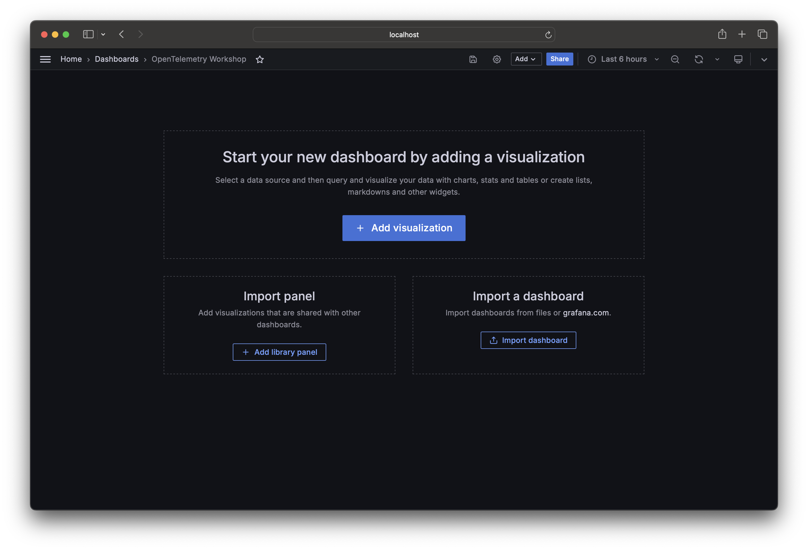
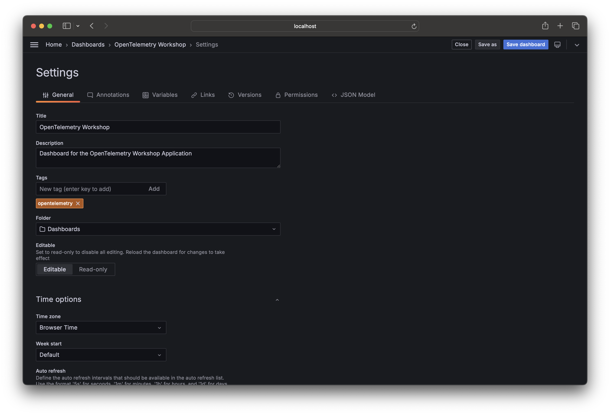
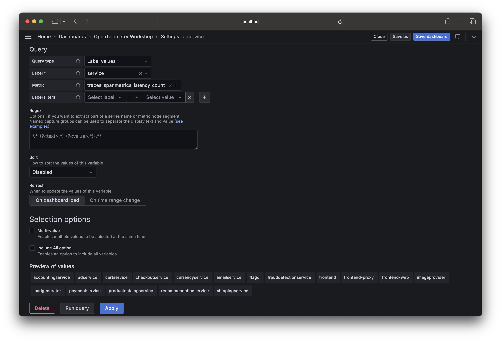
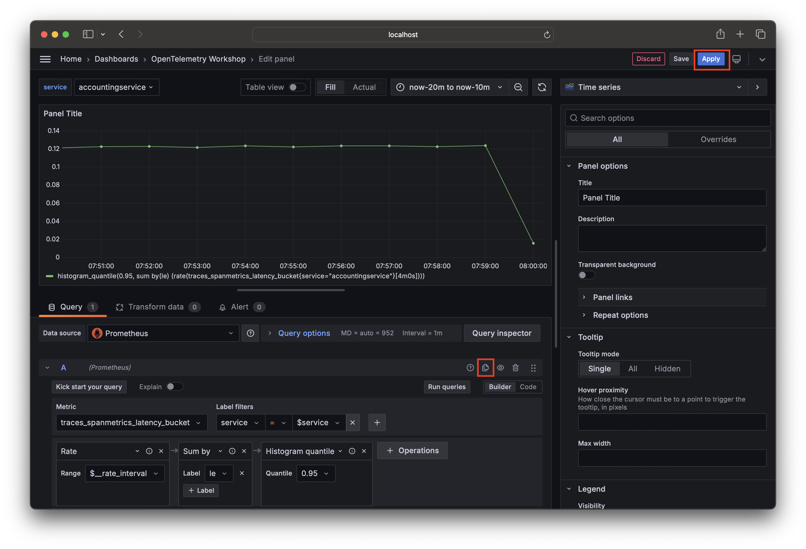
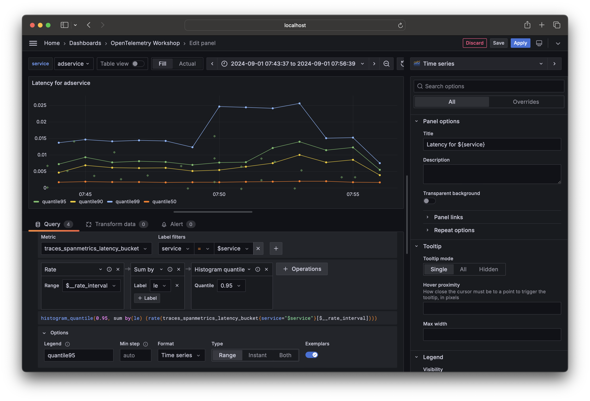

# Exercise 5: Create a Dashboard

In this section, we will create a dashboard to visualize the data collected for our OpenTelemetry instrumented application.

## Prerequisites

Make sure you have started the services required for the workshop. If you haven't done so, follow the instructions in the [Local setup](./02-setup.md) section.

## Create a dashboard

1. Open [localhost:8080/grafana](http://localhost:8080/grafana) in your browser.
2. In the left menu, and click on the [Dasbhaords](http://localhost:8080/grafana/dashboards) item.
3. Click on the [New](http://localhost:8080/grafana/dashboard/new) button to create a new dashboard.



Start by clicking the gear icon in on the top navigation bar. This will open the settings for the dashboard. Give the dasshboard a descriptive name, such as `OpenTelemetry Workshop`.



Click on the `Variables` tab and add a new variable. Name the variable `service` and set the type to `Query`.

In the Query Options section, set the following values:

- Data source: `Prometheus`
- Query type: `Label values`
- Label: `service`
- Metric: `traces_spanmetrics_latency_count`

You should see a list of services in the Preview values section to confirm that the query is working correctly.

Click on the `Apply` button to save the variable and click on the `Save dashboard` button in the top navigation bar to save your changes.



## Our first panel

Now we are ready to add some panels to our dashboard, start by clicking the prominent `+ Add visualization` button.

Let's start by visualizing span latency for our application.

Select the `Prometheus` data source, this will bring up the query builder that we will use to create our panel.

Select the following parameters:

- Metric: `traces_spanmetrics_latency_bucket`
- Label filters: `service` `=` `${service}`

Click on the `hint: add histogram_quantile` link to add the quantile function to the query.

!!! note
    A histogram is a type of metric that samples observations (usually things like request durations or response sizes) and counts them in configurable buckets. It also provides a sum of all observed values.

    The `histogram_quantile` function is built into the PromQL query language and calculates the selected quantile over time from a histogram.

    :question: What histogram quantile are we using to visualize the span latency?

Click on the `Run query` button to see the results of the query.



!!! note
    :question: What is the prometheus query that we are using to visualize the span latency?

    <details>
    <summary>Hint</summary>

    The PromQL query is displayed below the query builder filters. It should look like this:

    ```promql
    histogram_quantile(0.95, sum by(le) (rate(traces_spanmetrics_latency_bucket{service="$service"}[$__rate_interval])))
    ```
    </details>

Whenever you cange the service variable, the panel will update to show the span latency for the selected service. Try it for yourself!

Now let's add the other quantiles to the panel. Either click ont the `Add query` button below the query builder or click on the `Duplicate query` button to create a copy of the current query and change the quantile value.

Add the following qunatiles: `0.5`, `0.9`, and `0.99`. Click on the `Run query` button to see the results.

Lets add some better legends for the queries. Click on the `Options` tab and set the `Legend` field to the following values:

- `0.5`: `quantile50`
- `0.9`: `quantile90`
- `0.95`: `quantile95`
- `0.99`: `quantile99`

On the right hand side of the panel, you can set the panel title to `Latency for ${service}`.

The last thing we are going to do is enable exemplars in our panel. Exemplars are a powerful feature of Prometheus that allow you to see the exact trace that contributed to a specific data point in order to jump directly to trace view.

In the `Options` tab for one of the queries, enable the `Exemplars` option.



Click ont eh `Apply` button to save the changes to the panel and you should see the first panel in your dashboard. Click on the floppy disk icon in the top navigation bar to save the dashboard.